<p align="center">
  <a href="https://github.com/YosefHayim/launch-store">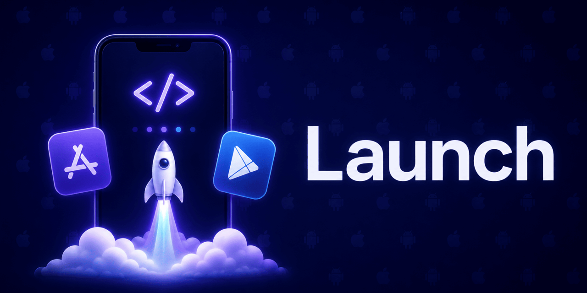</a>
</p>

<h1 align="center">Launch</h1>

<p align="center">
  <strong>오픈소스 셀프 호스팅 방식의 Expo EAS 대안 — 직접 보유한 머신에서 직접 보유한 키로 Expo / React Native 앱을 빌드, 서명하고 TestFlight 및 Google Play로 배포하세요. 빌드당 청구 비용이 없습니다.</strong>
</p>

<p align="center">
  <a href="https://www.npmjs.com/package/launch-store"></a>
  <a href="https://www.npmjs.com/package/launch-store"></a>
  <a href="https://github.com/YosefHayim/launch-store/actions/workflows/ci.yml"></a>
  <a href="./LICENSE"></a>
  
  
</p>

<!-- stats-badges:start — generated by `npm run docs:gen`; edit the source, then regenerate. -->

<p align="center">
  <a href="./docs/commands.md"></a>
  
  <a href="https://github.com/YosefHayim/launch-store/actions/workflows/ci.yml"></a>
</p>

<!-- stats-badges:end -->

<p align="center">
  <a href="./README.md">English</a> ·
  <a href="./README.zh-CN.md">简体中文</a> ·
  <a href="./README.ja.md">日本語</a> ·
  <b>한국어</b> ·
  <a href="./README.es.md">Español</a> ·
  <a href="./README.pt-BR.md">Português</a> ·
  <a href="./README.fr.md">Français</a> ·
  <a href="./README.de.md">Deutsch</a> ·
  <a href="./README.ru.md">Русский</a>
</p>

앱을 출시하는 일은 단순한 빌드 그 이상입니다. 서명 설정, [App Store Connect](https://developer.apple.com/app-store-connect/) / [Play Console](https://play.google.com/console) 구성, 인앱 구매, 스토어 등록 메타데이터, 업로드, 그리고 그 이후의 OTA 업데이트까지 모두 포함됩니다. EAS는 빌드와 제출을 처리하지만, 나머지는 Apple과 Google의 포털과 여러 도구에 흩어져 있습니다. Launch는 **출시 전체**를 하나의 로컬, 선언적 워크플로로 모읍니다. 서명을 프로비저닝하고, 스토어 제품을 조정하고, 네이티브 프로젝트를 생성하고, 바이너리를 빌드 및 서명하고, 실제 기기별 다운로드 크기를 보고하고, 아티팩트를 저장하고, 테스트 트랙으로 업로드합니다. 이 모든 작업이 직접 보유한 하드웨어에서, 로컬 keychain에 남아 있는 키로 이루어집니다. iOS 서명에는 Mac이 필요합니다. Mac이 없다면 Launch는 **본인 소유의** AWS 계정에 있는 클라우드 Mac에서 빌드하거나 Expo EAS로 작업을 넘깁니다 — [Mac 없이 빌드하기](#mac-없이-빌드하기)를 참고하세요.

> **처음이신가요?** `launch demo`를 실행하면 전체 파이프라인을 60초 동안 시뮬레이션한 둘러보기를 볼 수 있습니다 — 설정도, 빌드도, 계정도 필요 없습니다. `launch`를 처음 실행할 때 자동으로 재생되기도 합니다.

<!-- Feature map — one badge per stage of the release, in pipeline order. Mirrors the Features section below. -->
<table align="center">
  <tr>
    <td align="center">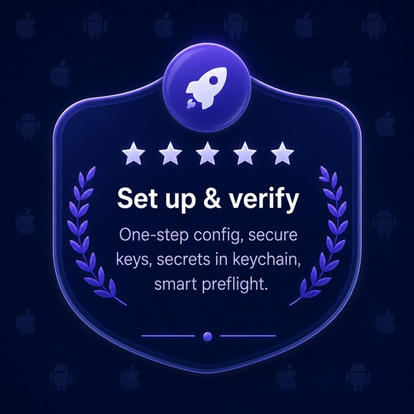</td>
    <td align="center">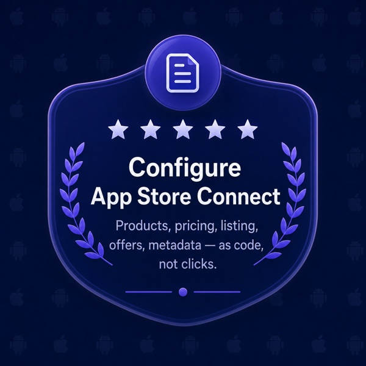</td>
    <td align="center">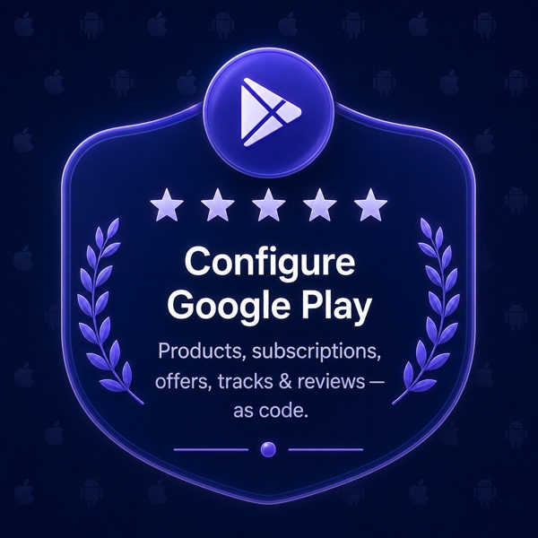</td>
    <td align="center">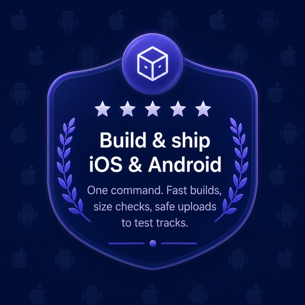</td>
    <td align="center">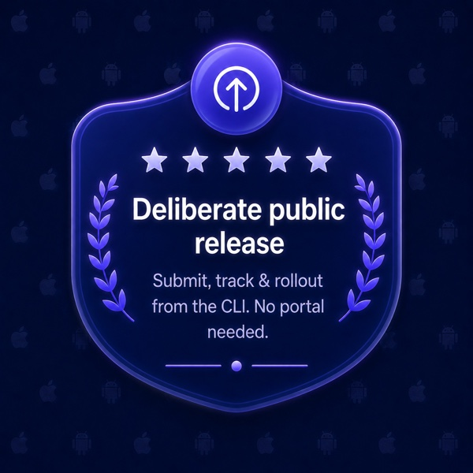</td>
  </tr>
  <tr>
    <td align="center">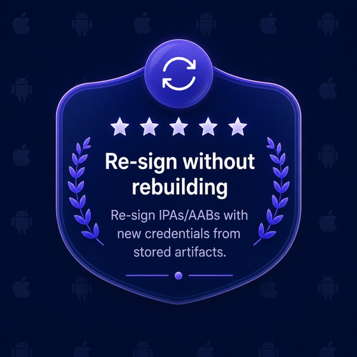</td>
    <td align="center">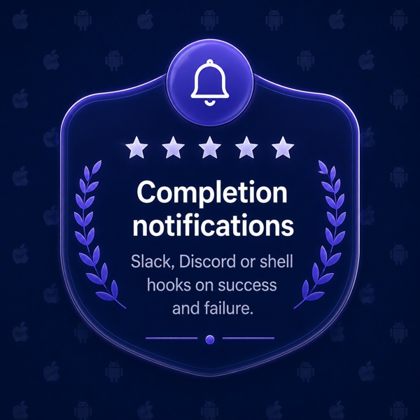</td>
    <td align="center">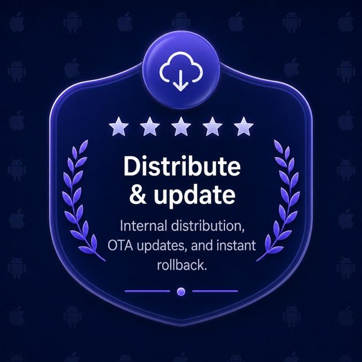</td>
    <td align="center">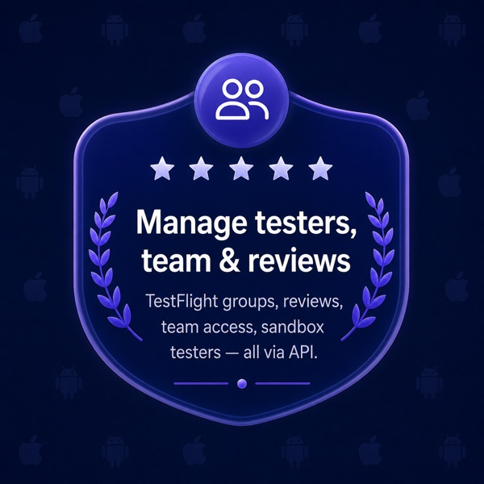</td>
    <td align="center">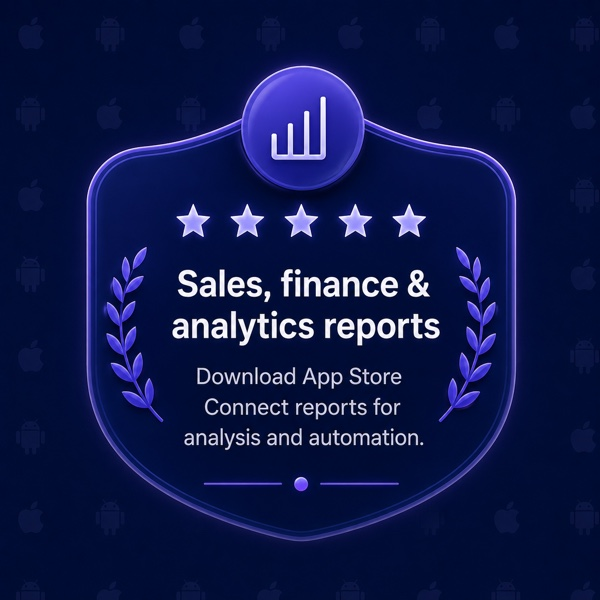</td>
  </tr>
</table>

## Launch를 선택하는 이유

빌드는 한 번도 어려운 부분이었던 적이 없습니다 — 그 주변의 출시 과정이 어려웠죠. Launch는 그 전체 영역을 로컬에서, 오픈소스로 책임집니다:

- **출시 전체를 하나의 워크플로로.** 서명, 스토어 제품, 빌드, 크기 검사, 업로드, OTA 업데이트가 모두 하나의 `launch.config.ts`와 몇 개의 명령에서 나옵니다 — 수십 개의 대시보드와 CI 스니펫이 아니라요.
- **코드로 관리하는 스토어 설정.** `launch sync`는 인앱 구매, 구독, 가격 책정, 기능(capabilities)을 하나의 타입이 지정된 `launch.config.ts`로부터 App Store Connect에 조정해 반영합니다. 그 외에 Game Center, Wallet, App Clips, 인앱 이벤트, A/B 실험, 판매 지역, Google Play 카탈로그 전체를 다루는 십여 개의 명령이 더 있으며, 스토어 등록 정보를 위한 `launch metadata`도 있습니다. 이것들은 EAS가 직접 클릭하도록 남겨둔 부분입니다.
- **컴퓨트 비용 $0, 무제한 빌드.** EAS는 빌드 단위로 청구하고, 45분 타임아웃 뒤에 무료 등급을 제한하며, 유료 플랜에서는 **월 $19–$199** 에 더해 초과 사용료를 받습니다. Launch는 직접 보유한 머신에서 빌드합니다 — 미터링도, 대기열도, 타임아웃도 없습니다.
- **키는 로컬에 남아 있습니다.** 배포 인증서, App Store Connect API 키, Android 업로드 키는 OS keychain에 남아 있고, Launch는 오직 CSR만 Apple로 전송합니다. (Mac 없이 빌드하는 경우가 유일한 예외입니다 — 아래를 참고하세요.)
- **결코 종속되지 않습니다.** MIT 라이선스이며, `fastlane`, Gradle, 그리고 각 플랫폼의 자체 API 위에 구축되었고, 스토리지/자격 증명/빌드/제출 제공자를 교체할 수 있습니다. 나중에 빠져나와야 할 독점 기술이 전혀 없습니다.
- **실행하면서 가르쳐 줍니다.** 어떤 명령에든 `--explain`을 붙이거나 `launch demo`를 실행하면 각 단계(CSR, 프로비저닝 프로파일, TestFlight, Play 트랙, 구독 그룹)를 알기 쉬운 설명으로 펼쳐 줍니다.

## Launch는 무엇이고, 무엇이 아닌가

**Launch는** 엔드 투 엔드 출시 도구입니다. 직접 보유한 하드웨어에서 iOS와 Android 모두에 대해 소스에서 스토어까지의 전체 경로 — 빌드, 코드 서명, 크기 검사, 코드로 관리하는 스토어 구성, 업로드, 정식 출시, OTA 업데이트 — 를 책임집니다.

**Launch는** 단순한 App Store Connect SDK나 ASC MCP 서버가 **아닙니다.** 그런 것들은 Apple API의 일부만 감싸지만, Launch는 Apple **과** Google 양쪽에 걸친 전체 출시를 주도하며, API 래퍼가 손대지 않는 서명, 빌드, OTA 업데이트까지 다룹니다. 단순한 API 클라이언트가 아니라 셀프 호스팅 방식의 Expo EAS를 원한다면, 그것이 바로 Launch입니다.

## 기능

**설정 및 검증**

- **한 단계로 끝나는 구성.** `launch init`은 (`apps/*` 모노레포를 포함해) 앱을 감지하고, 주석이 달린 `launch.config.ts`(와 시작용 `.env.example`)를 작성합니다. 구성만 작성할 뿐, 자격 증명이나 네이티브 프로젝트는 절대 건드리지 않습니다.
- **keychain에 저장되는 키.** `launch creds set-key`는 `~/Downloads`에서 `AuthKey_*.p8`을 찾아 Apple에 대해 검증한 뒤 OS 비밀 저장소에 보관합니다. `creds setup`은 앱 id를 등록하고 서명 자산을 생성하거나 재사용합니다. 멀티 계정에서는 `creds use/rename/remove`로 팀 간을 전환합니다. `creds push-key`는 한 번만 다운로드 가능한 APNs 인증 키(Apple은 이를 생성하는 API를 제공하지 않습니다)를 금고에 보관하고 필요할 때 다시 내보냅니다.
- **평문 `.env`가 아닌 시크릿.** `launch secret set <NAME>`은 빌드 시크릿을 OS keychain에 저장하고(앱/프로파일별로 범위 지정) 빌드 환경에 주입합니다 — 실제 시크릿이 커밋된 `.env`에 들어가지 않도록 합니다. `secret list`(마스킹됨)와 `secret rm`이 이를 완성합니다.
- **`launch doctor --fix`.** iOS/Android 툴체인을 감지하고 누락된 brew 설치 가능 도구를 단일 동의(`--yes`로 CI/에이전트용으로 건너뛸 수 있음) 하에 설치하고, 스토어 측 차단 요인 — 누락된 App Store Connect 레코드, 서명되지 않은 Apple 계약 — 을 표시하며, 알려진 네이티브 구성 함정(잘못된 bundle id / package, `backgroundColor`가 없는 스플래시)에 대해 Expo 구성을 검증합니다 — `launch build`가 미리 실행하는 것과 동일한 사전 점검으로, 한 줄짜리 구성 실수가 빌드가 아닌 1초 만에 실패하도록 합니다. 또한 EAS가 조용히 넘어가는 두 가지 제출 시점 함정을 드러냅니다: **수출 규정 준수(export-compliance)** 답변(`ios.config.usesNonExemptEncryption`에서 한 번 읽으며, `--fix`를 쓰면 최신 빌드에 대해 API로 답변함)과, 일회성 수동 **앱 개인정보 처리(App Privacy)** 설문 — Apple이 이에 대한 API를 전혀 노출하지 않으므로, Launch는 제출을 갑작스럽게 막는 대신 정확한 체크리스트를 출력합니다.
- **한눈에 보는 서명 상태.** `launch setup ios`는 iOS 프로비저닝을 처음부터 끝까지 보고합니다 — 활성 계정, App ID, 기능(capabilities), 배포 인증서, 프로파일, 등록된 기기 — 그리고 `--provision`을 쓰면 `launch creds setup`과 동일하게 인증서와 App Store 프로파일을 확보합니다.

**App Store Connect 구성 — 코드로**

아래의 각 섹션은 `launch.config.ts`(또는 독립적인 `*.config.json` 사이드카)에 선언되며, 읽기 전용 **계획 → 확인 → 적용** 방식으로 조정됩니다 — 멱등적으로, 라이브 또는 심사 중인 버전을 절대 건드리지 않습니다. 이 영역은 EAS가 App Store Connect 웹사이트에 전적으로 맡겨두는 부분입니다.

- **제품, 가격 및 스토어 등록.** `launch sync`는 인앱 구매, 구독, 기능(capabilities), 그리고 **가격**을 App Store Connect에 조정하며, 같은 패스에서 로케일별 **스토어 등록 문구**(이름, 부제, 설명, 키워드, 새 기능 안내, 개인정보 / 지원 / 마케팅 URL), **스크린샷**, **앱 미리보기**를 모든 앱에 대해 한 번에 조정합니다.
- **구독 혜택.** `launch offers`는 혜택 코드와 프로모션, 도입(introductory), 윈백(win-back) 혜택, 그리고 프로모션 구매 순서를 조정합니다. `launch offers generate-codes/list/deactivate`는 CLI에서 혜택 코드 캠페인을 운영합니다.
- **출시 속성.** `launch release-config`는 App Store **연령 등급, 카테고리, 기본 가격, App Review 세부사항**(연락처 + 데모 계정)을 편집 가능한 버전에 조정합니다.
- **앱 신원 및 권한(entitlements).** `launch game-center`(도전 과제 및 리더보드), `launch wallet`(Apple Pay 가맹점 id 및 Wallet 패스 유형 id), `launch app-clips`(App Clip 카드 액션 + 부제), 그리고 `launch eu-distribution`(DMA를 위한 EU 대체 배포 도메인 + 패키지 서명 키) — `spaceship`은 노출하지만 EAS는 노출하지 않는, 포털에서 클릭하던 팀 설정입니다.
- **머천다이징 및 노출.** `launch availability`(앱이 판매되는 지역), `launch custom-pages`(대체 제품 페이지), `launch experiments`(제품 페이지 A/B 테스트), `launch accessibility`(접근성 영양 성분 라벨), `launch events`(인앱 이벤트), 그리고 `launch metadata pull/push`(**iOS _와_ Android** 양쪽의 전체 스토어 등록 — `eas metadata`는 iOS 전용입니다).

**Google Play 구성 — 코드로**

- **Play 제품 및 구독.** `launch play-products`와 `launch play-subscriptions`는 App Store Connect를 구동하는 것과 **동일한** `launch.config.ts` 카탈로그로부터 Play 인앱 제품과 구독(기본 요금제 + 혜택)을 조정합니다 — 하나의 진실 공급원으로 양쪽 스토어를 다룹니다.
- **트랙 및 리뷰.** `launch play-tracks`는 트랙 상태를 보여주고 선택한 출시 비율과 출시 노트로 빌드를 트랙에 **승격**합니다(그리고 테스터 그룹을 읽고 설정합니다). `launch play-reviews`는 Play 고객 리뷰를 읽고 답글을 게시합니다 — Play Console을 열 필요 없이요.

**빌드 및 배포 — iOS 및 Android**

- **플랫폼당 하나의 명령.** `launch build ios` / `launch build android`는 prebuild → 서명 → 크기 검사 → 테스트 트랙(TestFlight / Play 내부)으로 업로드까지 실행합니다 — EAS가 실행하는 것과 동일한 흐름입니다.
- **기본적으로 빠릅니다.** ccache가 `pod install` 시점에 연결되고, DerivedData는 따뜻하게 유지되며, 네이티브 그래프 지문(fingerprint)이 네이티브 의존성이 실제로 바뀔 때만 클린 빌드를 강제합니다. JS 수정은 증분적으로 다시 빌드하며, `--clean`은 처음부터 다시 빌드하도록 강제합니다.
- **실제 다운로드 크기 검사.** 실제 기기별 크기(App Thinning 보고서 / bundletool)를 보고하고 구성한 `sizeBudgetMB`로 게이트를 겁니다.
- **안전 장치.** 시뮬레이터 빌드, `.app`, 빈 아티팩트의 업로드를 거부합니다. `--dry-run`은 네트워크, 빌드, 계정 변경 없이 전체 파이프라인을 리허설합니다.
- **의도적인 정식 출시 — 포털 불필요.** 테스트 트랙이 기본값이며, 공개 스토어는 별도로 확인을 거치는 `launch release <platform>`입니다. iOS의 경우 App Store Connect API를 처음부터 끝까지 구동합니다 — 버전 생성/재사용, 수출 규정 준수 답변, 빌드 첨부, 출시 노트 작성, 즉시 / 예약 / 단계적 출시 선택, 심사 제출 — 따라서 출시에 웹사이트가 결코 필요 없습니다. `launch status [--watch] [--json]`은 심사를 추적하고(CI 종료 코드 포함), `launch rollout pause|resume|complete`는 단계적 출시를 조종합니다. fastlane은 바이너리 업로드에만 한정됩니다.
- **다시 빌드하지 않고 재서명.** `launch build:resign`은 저장된 `.ipa`/`.aab`를 다른 자격 증명(새 계정이나 프로파일)으로 아티팩트에서 곧장 재서명합니다 — 다시 빌드하지 않습니다.
- **완료 알림.** `notify` 블록은 빌드나 제출이 끝날 때 Slack/Discord 웹훅에 핑을 보내거나 셸 훅을 실행합니다 — 성공 _과_ 실패 양쪽에서요 — 그래서 무인/CI 실행이 끝났을 때 알려줍니다. 호스팅 서비스 없이 EAS의 `webhook`과 동등합니다.

**배포 및 업데이트**

- **내부 배포.** `launch build <platform> --distribution internal`은 임시(ad-hoc) iOS 설치 링크 / Android `.apk`를 직접 보유한 버킷에 호스팅합니다. `launch device add <udid>`로 테스터를 등록하세요.
- **OTA 업데이트.** `launch update`는 `expo-updates`가 이미 사용하는 **Expo Updates 프로토콜**을 통해 JS/에셋 업데이트를 게시합니다 — 코드 서명되고 직접 보유한 버킷(S3 / R2 / Supabase)에 호스팅됩니다.
- **잘못된 업데이트 롤백.** `launch updates list/view`는 채널별 이력을 보여주고, `launch updates rollback`은 잘못된 OTA를 되돌립니다 — 정상으로 확인된 업데이트를 승격하거나 테스터를 내장 번들로 되돌립니다.

**테스터, 팀, 리뷰 및 보고서 관리 — API 키만으로**

- **CLI에서의 TestFlight.** `launch testflight groups/create-group/testers/add/rm`은 동일한 App Store Connect API 키로 베타 그룹을 관리하고 테스터를 초대합니다 — 빌드 업로드를 둘러싼 관리 계층으로, Apple ID 비밀번호도 2FA도 필요 없습니다.
- **리뷰 읽기 및 답글.** `launch reviews [list]`는 고객 리뷰를 읽고(평점 / 지역으로 필터링), `launch reviews reply`는 개발자 응답을 게시하거나 교체하며, `launch reviews delete`는 그것을 삭제합니다 — App Store Connect를 열 필요 없이요.
- **판매, 재무 및 분석 보고서.** `launch reports sales/finance/analytics`는 App Store Connect의 판매 및 트렌드, 재무, 분석 보고서(gzip 압축된 TSV)를 스크립팅을 위해 곧장 머신으로 다운로드합니다 — EAS가 결코 드러내지 않는 수치들입니다.
- **팀 및 접근 권한.** `launch team list/invite/remove`는 동일한 API 키로 App Store Connect 팀 구성원과 대기 중인 초대를 읽고 관리합니다 — 역할과 함께 이메일로 초대하거나 철회합니다.
- **샌드박스 테스터.** `launch sandbox list/clear`는 StoreKit 샌드박스 테스터를 나열하고 그들의 구매 이력을 지워, 깨끗한 상태에서 인앱 구매를 다시 테스트할 수 있게 합니다.

**점검 및 디버그**

- **빌드 이력.** `launch builds list/view/log`는 로컬 아티팩트 인덱스를 읽습니다 — id, 기기별 크기, 아티팩트 경로, 그리고 어떤 빌드든 그 원시 빌드 로그까지요.
- **설치 및 실행.** `launch run [id|latest]`는 빌드된 아티팩트를 연결된 기기나 시뮬레이터에 설치합니다(Android에는 `adb`/`bundletool`, iOS에는 `devicectl` 사용).
- **실패 원인 설명.** `launch diagnose`는 `xcodebuild`/Gradle/CocoaPods 오류를 알기 쉬운 원인과 해결책으로 매핑합니다. `launch fingerprint`는 다음 빌드가 왜 클린이 될지 증분이 될지 보여줍니다. `--verbose`는 진행 스피너 대신 원시 빌드 출력을 스트리밍합니다.

**온보딩 및 학습**

- **`launch demo`.** 설정이 전혀 필요 없는, 전체 파이프라인의 시뮬레이션 둘러보기입니다(첫 실행 시 한 번 자동 재생됨). 어떤 명령에든 붙이는 `--explain`과 `launch explain <topic>`은 필요할 때 용어를 다룹니다.
- **조용한 자가 업그레이드.** 더 새로운 npm 릴리스를 받아 그 위에서 명령을 다시 실행합니다 — 하루에 한 번으로 제한되며, CI에서, 파이프로 연결되었을 때, 그리고 에이전트에 대해서는 아무 동작도 하지 않습니다.

## Launch 대 EAS

Launch는 직접 보유한 하드웨어에서 동일한 `eas build` → `eas submit` → `eas update` 파이프라인(`eas metadata`와 `eas credentials` 포함)을 실행하며, EAS가 사용자에게 맡겨두는 스토어 설정 단계까지 다룹니다. 동일한 워크플로에서 둘이 다른 지점은 다음과 같습니다:

| Expo EAS에서                                                                                    | Launch에서                                                                                                                                        |
| ----------------------------------------------------------------------------------------------- | ------------------------------------------------------------------------------------------------------------------------------------------------- |
| 빌드 컴퓨트가 **Expo의 클라우드**에서 실행되고, **월 $19–$199** + 빌드당 요금                   | **직접 보유한 머신**에서 빌드 — **컴퓨트 $0**, MIT 라이선스, 무제한 빌드                                                                          |
| 빌드가 공유 클라우드에서 **대기**하며, 때로는 몇 시간씩                                         | 직접 보유한 하드웨어에서 빌드가 **즉시 시작** — 대기열 없음                                                                                       |
| 무료 등급 빌드는 **45분 타임아웃으로 제한**됨                                                   | **타임아웃 없음** — 빌드는 필요한 만큼 오래 실행됨                                                                                                |
| Apple ID **2FA** 프롬프트 / 만료된 코드가 빌드를 중단시킴                                       | **App Store Connect API 키(JWT)** 로 인증 — 비밀번호도, 2FA도 없음                                                                                |
| 툴체인/Node가 **빌드 이미지에 고정됨**; 로컬 `.env`는 해석되지 않음                             | 직접 보유한 Xcode/Node/툴체인과 문서화된 **환경 우선순위 사다리**(`--print-env`로 감사)                                                           |
| **인앱 구매 및 구독**이 ASC UI에서의 수작업                                                     | `launch sync`가 `launch.config.ts`로부터 **IAP, 구독 및 기능(capabilities)** 을 조정                                                              |
| EAS는 **빌드마다 bundle-id 기능(capabilities)을 다시 씀**(토글을 덮어씀)                        | `launch sync`는 **최소한의 안전한 diff**를 적용 — 관리하지 않는 기능(capabilities)은 그대로 유지됨                                                |
| `eas metadata`는 **iOS 전용**                                                                   | `launch metadata`는 **iOS _와_ Android** 양쪽의 스토어 등록을 동기화                                                                              |
| Play **IAP, 구독, 트랙 및 리뷰**는 Play Console UI를 의미함                                     | `launch play-products` / `play-subscriptions`가 **동일한** 구성으로 Play를 조정; `launch play-tracks` / `play-reviews`가 API로 트랙과 답글을 구동 |
| **Game Center, Wallet, App Clips, 인앱 이벤트, A/B 실험, 판매 지역 및 접근성**이 **포털 전용**  | 각각이 **코드로 관리하는 구성** — `launch game-center` / `wallet` / `app-clips` / `events` / `experiments` / `availability` / `accessibility`     |
| `eas submit` 이후, **App Store 출시**(버전, 규정 준수, 노트, 출시 비율)는 **포털에서의 수작업** | `launch release`가 **API**로 그것을 구동 — 이어서 `launch status --watch`와 `launch rollout`이 추적하고 조종                                      |
| **리뷰, 보고서 및 TestFlight 관리**가 웹사이트 방문을 의미함                                    | `launch reviews` / `launch reports` / `launch testflight`가 **API 키**로 처리 — 포털 불필요                                                       |
| **EAS Update**가 OTA 업데이트를 **Expo의 서버**에 호스팅(유료)                                  | `launch update`가 **직접 보유한 버킷**에서 **동일한 Expo Updates 프로토콜**을 제공(S3/R2/Supabase)                                                |
| **내부 배포** 빌드가 Expo에 의해 호스팅됨                                                       | `--distribution internal`이 임시(ad-hoc) `.ipa`/`.apk`를 **직접 보유한 버킷**에 호스팅; `launch device`                                           |
| 서명 **자격 증명이 Expo의 서버에 있을 수 있음**                                                 | 키가 **OS keychain**에 남아 있음 — 오직 **CSR**만 머신을 떠남                                                                                     |
| 빌드 **아티팩트가 Expo에 호스팅됨**                                                             | 아티팩트가 **직접 보유한 스토리지**(로컬, 또는 S3 / R2 / Supabase)에 저장됨                                                                       |
| **Mac이 없다고요?** EAS의 유료 클라우드가 유일한 경로                                           | **Mac이 없다고요?** **본인 소유의 AWS**에 있는 클라우드 Mac, **SSH**로 접근하는 아무 Mac, 또는 **`eas build`** 로 작업 넘기기                     |
| **폐쇄형 SaaS** — 독점적, 벤더 종속                                                             | **MIT, 오픈소스** — `fastlane`/Gradle/플랫폼 API, 교체 가능한 제공자, 이전할 것 없음                                                              |

## 요구 사항

- **iOS:** **Xcode** + 명령줄 도구가 설치된 macOS, **fastlane**(`brew install fastlane`), 그리고 **App Store Connect API 키**(`.p8` + Key ID + Issuer ID) — [여기서 생성하세요](https://appstoreconnect.apple.com/access/integrations/api). Mac이 없다고요? [Mac 없이 빌드하기](#mac-없이-빌드하기)를 참고하세요.
- **Android:** **JDK**(아무 OS — Mac 불필요)와 **Google Play 서비스 계정** JSON 키.
- 모든 플랫폼에서 **Node 20+**.

위 항목을 모두 확인하려면 언제든지 `launch doctor`를 실행하세요.

## 설치

```bash
npm install --save-dev launch-store     # per-project (recommended; resolves the typed launch.config.ts)
npm install --global launch-store       # or global, for just the `launch` command
```

## 빠른 시작

페이월에서 테스트 트랙까지 다섯 개의 명령으로(`ios` → `android`로 바꾸면 Google Play):

```bash
launch init                 # scaffold launch.config.ts + .env.example, tailored to your repo
launch creds set-key        # import your store API key into the OS keychain
launch creds setup          # register the app id + create/reuse signing assets
launch build ios --dry-run  # rehearse the whole flow — no network, no build, no account changes
launch build ios            # build, sign, size-check, and upload to the testing track
```

`launch build`는 캐시된 자격 증명을 조용히 재사용합니다. 누락된 경우 인라인으로 프로비저닝하겠다고 제안합니다. 정식 출시는 별도의 의도적인 `launch release <platform>`입니다.

인앱 구매나 구독을 판매하고 있나요? `launch.config.ts`에 선언하고 `launch sync`를 실행해 App Store Connect에서 생성하고 조정하세요 — 포털을 클릭해서 거칠 필요가 없습니다.

이미 앱을 배포하고 있나요? `launch adopt`는 라이브 App Store Connect 설정 — 제품, 기능(capabilities), 서명, 스토어 등록 — 을 읽어 한 단계로 구성에 다시 작성하므로, `sync`로 그것을 앞으로 끌고 나갈 수 있습니다.

## 명령

일상적으로 쓰는 것들:

| 명령                            | 하는 일                                                                         |
| ------------------------------- | ------------------------------------------------------------------------------- |
| `launch build <ios\|android>`   | 전체 파이프라인 실행 — prebuild, 서명, 빌드, 크기 검사, 테스트 트랙으로 업로드. |
| `launch release <ios\|android>` | 최신 빌드를 확인을 거쳐 **공개** 스토어로 배포.                                 |
| `launch update`                 | OTA JS 업데이트(Expo Updates 프로토콜)를 직접 보유한 버킷에 게시.               |
| `launch sync`                   | App Store Connect 제품, 가격, 스토어 등록을 `launch.config.ts`로부터 조정.      |
| `launch adopt`                  | 이미 배포 중인 앱을 온보딩 — 그 App Store Connect 설정을 구성으로 가져옴.       |
| `launch creds`                  | 자격 증명 점검, API 키 가져오기, 서명 프로비저닝, Apple 계정 전환.              |
| `launch doctor`                 | 로컬 툴체인과 스토어 계정이 준비되었는지 확인.                                  |

**[전체 명령 레퍼런스 → `docs/commands.md`](docs/commands.md)** — 45개의 모든 명령과 모든 플래그로, CLI에서 생성되므로 절대 어긋나지 않습니다. 또는 `launch <command> --help`를 실행하세요.

<!-- agent-skills:start — generated by `npm run docs:gen` from AGENT_SKILLS_BLURB; edit the source, then regenerate. -->

> **Driving Launch from an AI agent?** `launch agents init` scaffolds ready-made skills into your repo — Claude Skills (`.claude/skills/`), Cursor rules (`.cursor/rules/`), and a Launch section in `AGENTS.md` for Codex — so Claude Code, Cursor, and Codex can run the workflows above (ship, release, store-config-as-code, OTA updates, CI, and `launch doctor`) with the same plan → confirm → apply guardrails Launch uses, and never publish without your say-so. `launch agents check` keeps them in sync.

<!-- agent-skills:end -->

## 구성

앱 정보(bundle id, 버전)는 각 앱의 Expo 구성 — `app.json` 또는 `app.config.{ts,js}` — 에서 읽으므로 절대 중복되지 않습니다. `launch.config.ts`는 Launch 전용 설정만 담습니다:

```ts
import { defineConfig } from "launch-store";

export default defineConfig({
  // appRoots: ["./apps"],   // for a monorepo; omit to scan the repo root
  credentials: "local", // OS keychain + ~/.launch
  storage: "local", // ~/.launch/artifacts (swap for s3/r2/supabase later)
  buildEngine: "fastlane", // "fastlane" (local Mac) · "remote-mac" (AWS EC2 Mac) · "eas" (Expo cloud)
  // submit: "app-store-connect", // or "eas" to submit through Expo

  // Only needed to build iOS without a Mac via `--remote aws` — see "Building without a Mac".
  // aws: { region: "us-east-1" },

  profiles: {
    // `env` is inline per-profile vars; `envFile` renames the base dotenv. Precedence, highest first:
    // --env flags › keychain secrets › profile `env:` › .env.local (--include-local) › .env.<profile> › .env
    production: { name: "production", envFile: ".env", env: {}, sizeBudgetMB: 200 },
  },

  // Ping a Slack/Discord webhook and/or run a shell hook when a build or submit finishes (success or
  // failure). Both fields are optional; omit `notify` entirely for no notifications.
  // notify: { webhookUrl: "https://hooks.slack.com/services/…", command: "say build done" },

  // In-app purchases & subscriptions, keyed by bundle id — `launch sync` reconciles these onto App Store
  // Connect (and `launch play-products` / `play-subscriptions` onto Google Play). Capabilities aren't
  // declared here; they're read from app.json's `ios.entitlements`. Omit if your app sells nothing.
  // products: { "com.company.app": { subscriptionGroups: [/* … */], inAppPurchases: [/* … */] } },

  // Launch-native App Store Connect sections — each reconciled by its own command, declared inline here
  // (or, for back-compat, as a standalone `*.config.json` sidecar). Per-app ones are keyed by iOS bundle
  // id; Wallet & EU distribution are team-level. See examples/hello-world for a worked copy of each.
  // gameCenter: { "com.company.app": { achievements: [/* … */], leaderboards: [/* … */] } },
  // appClips: { "com.company.app": { clips: { "com.company.app.Clip": { action: "OPEN" } } } },
  // releaseAttributes: { "com.company.app": { pricing: { customerPrice: 9.99 }, categories: { primary: "PRODUCTIVITY" } } },
  // wallet: { merchantIds: [/* … */], passTypeIds: [/* … */] },
  // euDistribution: { domains: [/* … */] },
});
```

단 한 번의 빌드도 실행하기 전에 `launch build <platform> --print-env`를 실행하면 완전히 해석된 환경과 각 값이 어디에서 왔는지(시크릿은 마스킹됨)를 볼 수 있습니다. 제품, 혜택, 출시 속성에서부터 Game Center, Wallet, EU 배포, Google Play 카탈로그까지 모든 코드로-관리-구성 영역을 실행해 보는 풀 기능, 듀얼 플랫폼(iOS + Android) 예제가 [`examples/hello-world`](./examples/hello-world)에 있습니다(기능별 둘러보기는 그 README를 참고하세요).

## Mac 없이 빌드하기

iOS 서명은 macOS 전용이므로 Windows/Linux 개발자는 어딘가에 Mac이 필요합니다. `launch`(마법사)를 실행하거나 경로를 직접 선택하세요. Android는 JDK가 실행되는 곳이라면 어디서든 빌드되므로 이 내용은 Android에 해당하지 않습니다.

| 경로                 | 무슨 일이 일어나는가                                                                                            | 비용                                                                                        |
| -------------------- | --------------------------------------------------------------------------------------------------------------- | ------------------------------------------------------------------------------------------- |
| **AWS 클라우드 Mac** | Launch가 **본인 소유의** AWS 계정에 EC2 Mac을 프로비저닝하고, 빌드 + 서명 + 제출한 뒤, 해제합니다.              | AWS에 직접 지불 — **24시간 세션당 최소 ~$16**(Apple의 라이선스가 24시간 하한을 강제합니다). |
| **Mac 연결(SSH)**    | 접근 가능한 아무 Mac에서 빌드 — 동료의 Mac, MacStadium, 직접 띄운 인스턴스.                                     | 그 Mac에 드는 비용이 얼마든.                                                                |
| **Expo EAS**         | Launch가 Expo의 클라우드에서 `eas-cli`를 처음부터 끝까지 오케스트레이션(`eas build` → 다운로드 → `eas submit`). | 월간 한도가 있는 Expo의 **무료 등급**.                                                      |

```bash
launch build ios --remote aws            # build on a cloud Mac in your AWS account
launch build ios --remote ec2-user@host  # build on a Mac you reach over SSH
launch cloud doctor                      # check AWS creds, region, Mac-host quota, IAM
launch cloud status                      # live host: age, cost so far, releasable-after time
launch cloud teardown                    # stop + release the host (warns about the 24h floor)
```

원격 빌드는 명시적 동의 하에 서명 키의 임시 복사본을 **본인 소유의** 호스트로 업로드한 뒤 파쇄합니다 — 다른 누군가의 서버로는 절대 보내지 않습니다. 가끔 하는 iOS 빌드라면 GitHub Actions의 macOS 러너가 EC2 Mac보다 저렴합니다. 여기서 Launch의 가치는 어디서나 동일한 키로 본인 계정에서 자동화하는 데 있습니다.

## 자격 증명은 어떻게 처리되는가

- API 키(`.p8`), 배포 개인 키, Android 업로드 키는 **OS keychain**에 있습니다.
- iOS 인증서는 `~/.launch/credentials/` 아래에 비밀번호로 보호된 `.p12`로도 백업됩니다(chmod 600). 비밀번호는 파일 옆이 아니라 keychain에 저장됩니다.
- 개인 키는 로컬에서 생성됩니다 — 오직 CSR만 Apple로 전송됩니다.
- Launch는 새 인증서를 만드는 대신 기존 배포 인증서를 재사용합니다(스토어가 인증서 개수를 제한하기 때문입니다).

## FAQ

**Launch는 무엇인가요?** Launch는 오픈소스 셀프 호스팅 방식의 Expo EAS 대안입니다: 직접 보유한 머신에서 직접 보유한 키로 Expo / React Native 앱을 빌드, 서명하고 TestFlight 및 Google Play로 배포하며, 빌드당 청구 비용이 없습니다. EAS가 실행하는 것과 동일한 빌드 → 제출 → 업데이트 파이프라인을 실행하고, EAS가 App Store Connect 및 Play Console 웹사이트에 맡겨두는 스토어 설정 단계 — 인앱 구매, 구독, 기능(capabilities), 스토어 등록 메타데이터 — 를 코드로 추가합니다.

**Launch는 무료 오픈소스 Expo EAS 대안인가요?** 네. Launch는 MIT 라이선스의 완전한 오픈소스이며, 빌드가 직접 보유한 하드웨어에서 실행되므로 빌드당 요금, 빌드 분 미터, 구독료가 없습니다 — EAS의 $19–$199/mo 유료 플랜과 빌드당 초과 요금에 비해 그렇습니다. 유일한 선택적 비용은 Mac 없이 iOS를 빌드해야 할 경우 클라우드 Mac을 임대하는 것입니다.

**Launch는 Expo EAS와 어떻게 다른가요?** EAS는 Expo의 클라우드에서 빌드를 실행하고 자격 증명, 아티팩트, OTA 업데이트를 Expo의 서버에 보관합니다. Launch는 동일한 파이프라인을 직접 보유한 머신에서 실행하고, 서명 키를 OS keychain에 보관하며, 아티팩트와 OTA 업데이트를 직접 보유한 버킷(S3 / R2 / Supabase)에 저장합니다 — 그런 다음 EAS가 다루지 않는 스토어 구성(IAP, 구독, 기능(capabilities), iOS 및 Android 등록)을 코드로 관리합니다. 명령이 일대일로 대응됩니다: `eas build` → `launch build`, `eas submit` → `launch release`, `eas update` → `launch update`, `eas metadata` → `launch metadata`, `eas credentials` → `launch creds`.

**Mac 없이 iOS 앱을 빌드할 수 있나요?** iOS 코드 서명과 빌드 툴체인은 macOS 전용이므로 어딘가에 Mac이 있어야 합니다 — 하지만 반드시 본인 것이어야 할 필요는 없습니다. Launch는 본인 소유의 AWS 계정에 클라우드 Mac(EC2 Mac)을 프로비저닝하거나, SSH로 접근 가능한 아무 Mac에서 빌드하거나, Expo EAS의 클라우드로 작업을 넘길 수 있습니다. Android는 JDK가 실행되는 곳이라면 어디서든 빌드되며 Mac이 전혀 필요 없습니다.

**Launch는 Android와 Google Play를 지원하나요?** 네. Launch는 Android 앱을 빌드 및 서명하고 Google Play에 업로드하며, App Store Connect를 구동하는 것과 동일한 `launch.config.ts` 카탈로그로부터 Play 인앱 제품, 구독(기본 요금제 + 혜택), 출시 트랙, 리뷰 답글을 조정합니다 — 양쪽 스토어에 대한 하나의 진실 공급원입니다.

**Launch는 EAS Update처럼 OTA 업데이트를 지원하나요?** 네. `launch update`는 `expo-updates` 런타임이 이미 사용하는 Expo Updates 프로토콜을 통해 JS 및 에셋 업데이트를 게시합니다 — 코드 서명되고 Expo의 서버가 아닌 직접 보유한 버킷(S3 / R2 / Supabase)에 호스팅됩니다. `launch updates rollback`은 정상으로 확인된 업데이트를 승격하거나 클라이언트를 내장 번들로 되돌려 잘못된 릴리스를 되돌립니다.

**Expo EAS에서 Launch로 어떻게 마이그레이션하나요?** 명령을 일대일로 교체하세요(`eas build` → `launch build`, `eas submit` → `launch release`, `eas update` → `launch update`, `eas credentials` → `launch creds`, `eas metadata` → `launch metadata`). 앱이 이미 배포 중이라면 `launch adopt`가 라이브 App Store Connect 설정 — 제품, 기능(capabilities), 서명, 등록 — 을 읽어 한 단계로 `launch.config.ts`에 다시 작성합니다. Launch는 Mac이 없을 때 여전히 `eas build`로 작업을 넘길 수 있으므로 점진적으로 마이그레이션할 수 있습니다.

**Launch는 단순한 App Store Connect SDK나 MCP 래퍼인가요?** 아닙니다. App Store Connect SDK나 MCP 서버는 Apple API의 일부만 감쌉니다. Launch는 Apple과 Google 양쪽에 걸친 전체 출시를 주도합니다 — 코드 서명, 네이티브 빌드, 크기 검사, 코드로 관리하는 스토어 구성, 확인된 정식 출시, OTA 업데이트 — 이 중 어느 것도 API 래퍼는 건드리지 않습니다. API 클라이언트가 아닌 셀프 호스팅 방식의 Expo EAS를 원한다면, 그것이 바로 Launch입니다.

**Launch는 Fastlane과 어떻게 다른가요?** Fastlane은 빌딩 블록이고, Launch는 그것을 오케스트레이션합니다. Launch는 fastlane을 바이너리 업로드 단계에만 사용하며 그 주변으로 전체 출시를 감쌉니다: 자격 증명 프로비저닝, 빌드, 실제 다운로드 크기 검사, 양쪽 스토어를 위한 코드로 관리하는 스토어 구성, 의도적인 정식 출시, 단계적 출시 제어, OTA 업데이트 — 모두 하나의 타입이 지정된 `launch.config.ts`에서.

**서명 키와 시크릿은 어디에 저장되나요?** OS keychain에 있습니다. App Store Connect API 키(`.p8`), 배포 개인 키, Android 업로드 키는 저장소나 누군가의 서버에 절대 닿지 않습니다 — 인증서 서명 요청(CSR)만 Apple로 전송됩니다. 빌드 시크릿도 `launch secret`을 통해 keychain에 저장되므로 커밋된 `.env`에서 벗어납니다.

**Launch를 실행하려면 무엇이 필요한가요?** 모든 곳에서 Node 20+. iOS의 경우: Xcode와 명령줄 도구가 설치된 macOS, fastlane, App Store Connect API 키(`.p8` + Key ID + Issuer ID) — Mac이 없다면 원격 Mac. Android의 경우: JDK(아무 OS)와 Google Play 서비스 계정 JSON 키. `launch doctor`를 실행하면 한 번에 모두 확인됩니다.

**Launch는 얼마나 하나요?** Launch 자체는 무료(MIT)입니다. 어차피 지불했을 것만 지불하면 됩니다: 직접 보유한 빌드 하드웨어(또는 로컬 Mac 없이 iOS를 빌드할 경우 클라우드 Mac 시간), 그리고 일반적인 Apple Developer($99/yr)와 Google Play(일회성 $25) 등록 요금. 빌드당 요금도 구독료도 없습니다.

**Launch는 CI에서 실행되나요?** 네. `launch ci init`은 호스팅 macOS 러너에서 GitHub Actions 워크플로를 스캐폴딩하며, 모든 명령은 CI, 파이프로 연결된 stdout, 또는 에이전트를 감지했을 때 비대화형으로 동작하므로 동일한 흐름이 무인으로 실행됩니다.

**Launch는 어떤 프레임워크를 지원하나요?** Expo 구성(`app.json` / `app.config.{ts,js}`)과 `expo prebuild`를 통해 스스로를 기술하는 Expo 및 베어 React Native 앱. Launch는 거기서 bundle id, 버전, entitlements를 읽으므로 아무것도 중복되지 않습니다.

**Launch는 스토어 메타데이터, 인앱 구매, 구독을 관리할 수 있나요?** 네 — 코드로, 양쪽 스토어 모두. `launch sync`는 IAP, 구독, 가격 책정, 기능(capabilities), 그리고 로케일별 등록(문구, 스크린샷, 미리보기)을 App Store Connect에 조정합니다; `launch metadata`는 iOS와 Android의 등록을 다룹니다; `launch play-products` / `launch play-subscriptions`는 Google Play 카탈로그를 구동합니다. 각각은 읽기 전용 계획 → 확인 → 적용을 실행하므로 라이브나 심사 중인 버전을 절대 덮어쓰지 않습니다.

**Launch가 호스팅 서비스에 종속시키나요?** 아닙니다 — 호스팅되는 것도, 독점적인 것도 전혀 없습니다. Launch는 MIT 라이선스이며, fastlane, Gradle, 각 플랫폼의 자체 API를 기반으로 구축되었고, 교체 가능한 스토리지/자격 증명/빌드/제출 제공자가 있습니다. 키, 아티팩트, 업데이트는 본인이 제어하는 인프라에 있으므로 나중에 마이그레이션할 것이 전혀 없습니다.

**어떻게 시작하나요?** `npm install --global launch-store`(또는 프로젝트별로 `--save-dev`)로 설치한 뒤, `launch demo`를 실행하면 60초 시뮬레이션 둘러보기를 볼 수 있습니다 — 설정도, 계정도 필요 없습니다. 준비가 되면: `launch init` → `launch creds set-key` → `launch creds setup` → `launch build ios`.

## 기여하기

개발 환경 설정, 품질 게이트, 백엔드 추가 방법은 [`CONTRIBUTING.md`](./CONTRIBUTING.md)를 참고하세요.

## 기여자

<p align="center">
  <a href="https://github.com/YosefHayim"></a>
</p>

<p align="center">
  <a href="https://github.com/YosefHayim/launch-store/graphs/contributors">모든 기여자 →</a>
</p>

## 라이선스

MIT

---

<sub>Launch는 오픈소스 **Expo EAS 대안**입니다 — **직접 보유한 머신에서 React Native 앱을 빌드하여 App Store와 Google Play로 배포하는** 로컬, 셀프 호스팅 방식입니다: iOS 코드 서명, TestFlight & Google Play 제출, 코드로 관리하는 스토어 구성, Expo 프로토콜 OTA 업데이트, 그리고 빌드당 청구 비용 없음.</sub>
