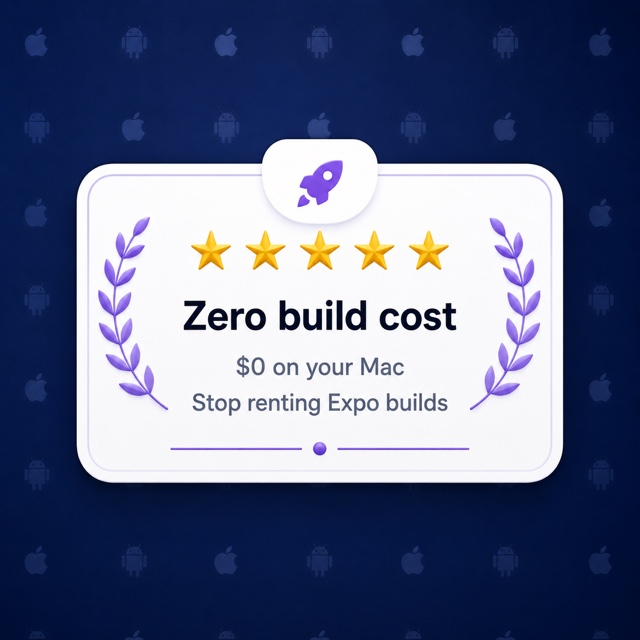
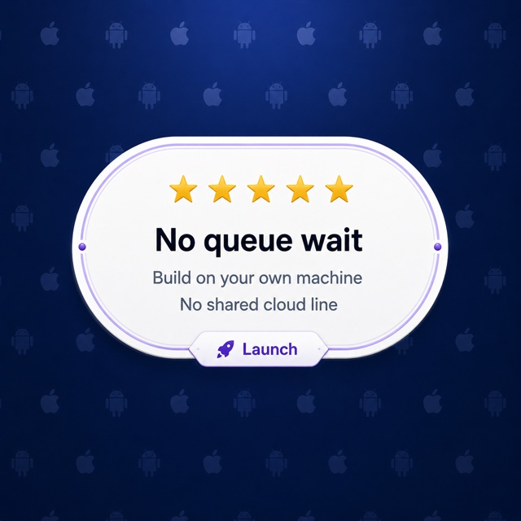
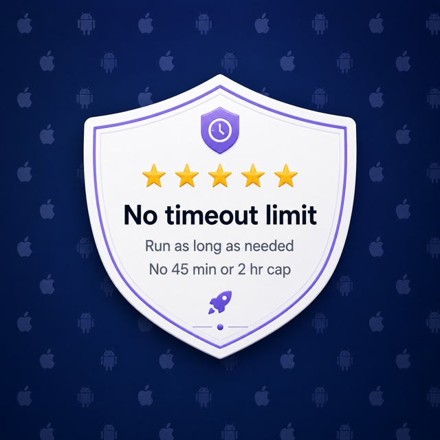
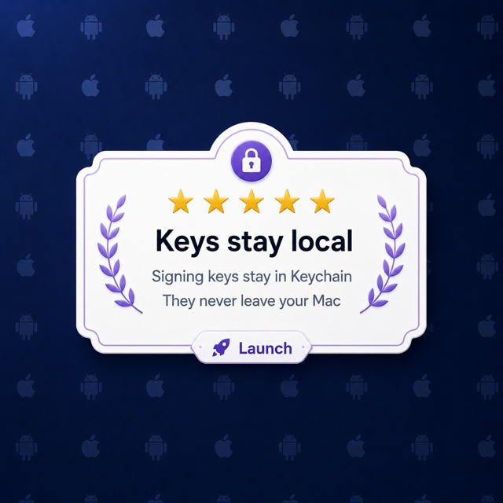
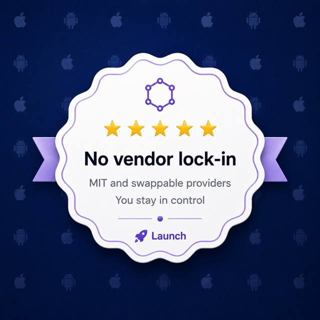
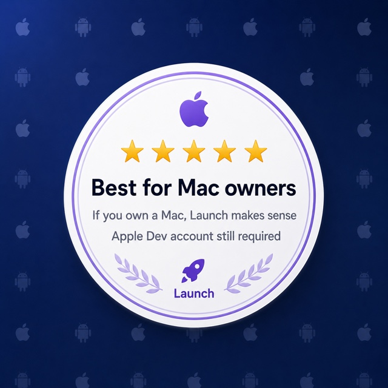

<p align="center">
  
</p>

<h1 align="center">Launch</h1>

<p align="center">
  <strong>Ship your iOS app to TestFlight from your own Mac — your keys, your hardware, no Expo bill.</strong>
</p>

Launch does locally what EAS Build does in Expo's cloud: it generates the native project, manages your
Apple signing credentials, builds and signs the `.ipa`, reports the real per-device download size, and
uploads to TestFlight — on the Mac you already own, with keys that stay in your local Keychain. No Mac?
Launch can also build on a cloud Mac in **your own** AWS account or hand off to Expo EAS — see
[Building without a Mac](#building-without-a-mac).

> Today Launch ships **iOS → TestFlight**. Storage, credentials, build, and submit are pluggable
> interfaces, so Android and cloud backends drop in as one-file additions.

<table align="center">
  <tr>
    <td align="center"></td>
    <td align="center"></td>
    <td align="center"></td>
  </tr>
  <tr>
    <td align="center"></td>
    <td align="center"></td>
    <td align="center"></td>
  </tr>
</table>

## Why developers switch to Launch

Hit **Expo's EAS Build** paywall? Launch runs the same build → sign → TestFlight flow on hardware you
already control — free and open source.

- **$0 compute, unlimited builds.** EAS bills by build: the free tier caps your monthly builds behind a
  45-minute timeout, and paid plans run **$19–$199/mo** plus overage. Launch builds on your own Mac — no
  meter, no queue, no timeout.
- **Your keys stay in your local keychain.** For local builds, your distribution certificate and App Store
  Connect API key stay in your OS keychain; Launch only ever sends a CSR to Apple. A hosted service keeps
  your keys on _its_ servers — Launch never sees them. (Building without a Mac is the one exception: with
  your explicit consent, a transient copy is uploaded to **your own** cloud/remote Mac and shredded after
  the build — never to anyone else's servers. See [Building without a Mac](#building-without-a-mac).)
- **No lock-in, ever.** MIT-licensed, built on `fastlane` and Apple's own tooling, with pluggable
  storage/credentials/build/submit layers. Nothing proprietary to migrate off later.
- **It teaches as it runs.** Add `--explain` to any command to expand each step — CSR, provisioning
  profile, TestFlight — into plain English.

## Features

Everything Launch does today, on hardware you control:

**Build & ship (iOS)**

- **One command to TestFlight.** `launch build ios` generates the native project, signs the `.ipa`, and
  uploads — the same build → sign → submit flow EAS runs, on your own Mac.
- **Real download-size check.** Reports the actual per-device size and fails the build if it busts the
  `sizeBudgetMB` you configured.
- **Artifact safety net.** Refuses to upload a simulator build, a `.app`, or an empty `.ipa` — mistakes
  that otherwise fail opaquely deep inside submit.
- **Dry run.** `--dry-run` rehearses the entire pipeline with no network, no build, and no account changes.
- **Deliberate public release.** TestFlight is the default; pushing to the public App Store review queue is
  the separate, confirmed `launch release ios`.

**Credentials, kept local**

- **API key in your Keychain.** Your App Store Connect `.p8` and distribution key live in the macOS
  Keychain; only a CSR is ever sent to Apple.
- **Auto-discovering `set-key`.** `launch creds set-key` finds the `AuthKey_*.p8` in `~/Downloads`, reads
  the Key ID from its filename, and asks only for what it can't infer — or runs fully unattended from
  flags/env (`ASC_KEY_ID`, `ASC_ISSUER_ID`, `ASC_API_KEY_PATH`) for CI.
- **Reuses what Apple caps.** Picks up your existing distribution certificate and provisioning profile
  instead of minting new ones, and provisions them inline when they're missing.

**Zero-friction onboarding**

- **`launch doctor --fix`.** Detects the whole iOS toolchain — Xcode, Ruby, fastlane, CocoaPods, openssl,
  Node — and installs the missing brew-able tools after a single consent (Homebrew is bootstrapped behind a
  typed-`yes`; Xcode is guided). `--yes` skips every prompt for CI and agents.
- **Interactive front door.** Running `launch` with no arguments lifts off an animated rocket banner, then a
  wizard that detects your OS and routes the build accordingly.
- **Silent self-upgrade.** Picks up a newer release from npm and re-runs your command on it — guarded and
  throttled to once a day, and a no-op in CI, when piped, and for agents.
- **`--explain` anything.** Expand each step — CSR, provisioning profile, TestFlight — into plain English on
  any command.

**Build without a Mac**

- **Your own cloud Mac.** Provision an EC2 Mac in _your own_ AWS account, build, then tear it down —
  `launch cloud` manages the host with live cost tracking.
- **Any Mac over SSH, or Expo EAS.** Hand off to a Mac you already reach (`--remote user@host`) or to Expo's
  cloud — see [Building without a Mac](#building-without-a-mac).

**Open by design**

- **MIT, no lock-in.** Pluggable storage, credentials, build, and submit providers built on `fastlane` and
  Apple's own tooling — nothing proprietary to migrate off later.

## Platform support

<table align="center">
  <tr>
    <td align="center" width="240"></td>
    <td align="center" width="240"></td>
  </tr>
  <tr>
    <td align="center"><strong>iOS</strong><br />✅ Shipping now — build, sign &amp; upload to TestFlight</td>
    <td align="center"><strong>Android</strong><br />🚧 Planned — pluggable interfaces designed, not yet built</td>
  </tr>
</table>

## Built for Mac owners

Launch needs a **Mac with Xcode** — Apple only allows iOS apps to be signed on macOS. That constraint is
exactly why your signing keys stay on your own hardware instead of a build farm: no Windows or Linux host,
no shared cloud queue, just your machine.

No Mac, or you ship only once in a while? A **GitHub Actions macOS runner** (free on public repos, Xcode
preinstalled) is a solid fit too — and Launch itself can build without a local Mac, below.

## Building without a Mac

iOS signing is macOS-only, so a Windows/Linux developer needs a Mac somewhere. Run `launch` with no
arguments for an interactive wizard that detects your OS and offers three honest paths:

| Path                    | What happens                                                                                            | Cost                                                                                             |
| ----------------------- | ------------------------------------------------------------------------------------------------------- | ------------------------------------------------------------------------------------------------ |
| **AWS cloud Mac**       | Launch provisions an EC2 Mac in **your own** AWS account, builds + signs + submits, then tears it down. | You pay AWS directly — **~$16 minimum per 24h session** (Apple's license sets a hard 24h floor). |
| **Expo EAS**            | Launch orchestrates `eas-cli` end-to-end (`eas build` → download → `eas submit`) on Expo's cloud.       | Expo's **free tier** with monthly caps.                                                          |
| **Connect a Mac (SSH)** | Build on any Mac you can reach — a colleague's, MacStadium, a hand-launched instance.                   | Whatever that Mac costs you.                                                                     |

Or drive it directly:

```bash
launch build ios --remote aws            # build on a cloud Mac in your AWS account
launch build ios --remote ec2-user@host  # build on a Mac you reach over SSH
launch cloud doctor                      # check AWS creds, region, Mac-host quota, IAM
launch cloud status                      # live host: age, cost so far, releasable-after time
launch cloud teardown                    # stop + release the host (warns about the 24h floor)
```

The honest tradeoff: for occasional builds a GitHub Actions macOS runner is cheaper than EC2 Mac. Launch's
value here is automation in **your own** account with the **same keys everywhere**, not "cheaper than EAS."
Remote builds upload a transient copy of your signing keys to your own host with explicit consent and shred
them after.

## Requirements

- macOS with **Xcode** + command-line tools
- **fastlane** (`brew install fastlane`)
- **openssl** (ships with macOS) — generates your distribution key/CSR locally
- **Node 20+**
- An **App Store Connect API key** (`.p8` + Key ID + Issuer ID) — [generate one here](https://appstoreconnect.apple.com/access/integrations/api)

Run `launch doctor` any time to check all of the above.

## Install

Launch is on npm. Install it as a dev dependency of your app so the typed `launch.config.ts` import
resolves, or globally for just the `launch` command:

```bash
npm install --save-dev launch-store     # per-project (recommended)
npm install --global launch-store       # or global
```

## Quick start

From paywall to TestFlight in five commands:

```bash
launch init                 # scaffold launch.config.ts + .env.example, tailored to your repo
launch creds set-key        # import your App Store Connect API key into the Keychain
launch creds setup          # register the App ID + create/reuse your cert & provisioning profile
launch build ios --dry-run  # rehearse the whole flow — no network, no build, no account changes
launch build ios            # build, sign, size-check, and upload to TestFlight
```

`launch build` reuses your cached certificate and profile silently; if they're missing it offers to
provision them inline. Public App Store submission is the separate, deliberate `launch release ios`.

## Commands

| Command                                          | What it does                                                                                                                      |
| ------------------------------------------------ | --------------------------------------------------------------------------------------------------------------------------------- |
| `launch`                                         | Interactive wizard — detects your OS and routes (the Expo-style front door, great on a non-Mac).                                  |
| `launch init`                                    | Scaffold `launch.config.ts` (+ `.env.example`) into the current repo.                                                             |
| `launch build <ios\|android>`                    | Run the full pipeline and upload to TestFlight. Flags: `--profile`, `--app`, `--explain`, `--no-submit`, `--remote`, `--dry-run`. |
| `launch release <ios\|android>`                  | Submit the latest stored build to the **public** App Store review queue (with confirmation).                                      |
| `launch creds [status\|set-key\|setup]`          | Inspect, import the API key, or provision the cert + profile.                                                                     |
| `launch cloud [setup\|status\|teardown\|doctor]` | Manage the remote AWS EC2 Mac build host (see [Building without a Mac](#building-without-a-mac)).                                 |
| `launch doctor`                                  | Check the toolchain and Apple account (missing app record, unsigned agreements).                                                  |
| `launch explain [topic]`                         | Plain-English glossary (`csr`, `app-record`, `provisioning-profile`, `ec2-mac`, …).                                               |

Add `--explain` to any build to expand every step into a short teaching block — useful whether it's your
first iOS release or your hundredth.

## Configuration

App facts (bundle id, version) are read from each app's Expo config — `app.json` or a dynamic
`app.config.{ts,js}` — so they're never duplicated. `launch.config.ts` holds only Launch-specific
settings:

```ts
import { defineConfig } from "launch-store";

export default defineConfig({
  // appRoots: ["./apps"],   // for a monorepo; omit to scan the repo root
  credentials: "local", // macOS Keychain + ~/.launch
  storage: "local", // ~/.launch/artifacts (swap for s3/r2/supabase later)
  buildEngine: "fastlane", // "fastlane" (local Mac) · "remote-mac" (AWS EC2 Mac) · "eas" (Expo cloud)
  // submit: "app-store-connect", // or "eas" to submit through Expo

  // Only needed to build without a Mac via `--remote aws` — see "Building without a Mac".
  // aws: { region: "us-east-1" },

  profiles: {
    production: { name: "production", envFile: ".env", sizeBudgetMB: 200 },
  },
});
```

A worked example lives in [`examples/hello-world`](./examples/hello-world).

## Contributing

See [`CONTRIBUTING.md`](./CONTRIBUTING.md) for dev setup, the quality gate, and how to add a backend.

## How your credentials are handled

- The API key (`.p8`) and the distribution private key live in the **macOS Keychain**.
- The certificate is also backed up as a password-protected `.p12` under `~/.launch/credentials/`
  (chmod 600); the password is stored in the Keychain, never beside the file.
- Your private key is generated locally — only a CSR is ever sent to Apple.
- Launch reuses an existing distribution certificate instead of creating new ones (Apple caps them).

## License

MIT
