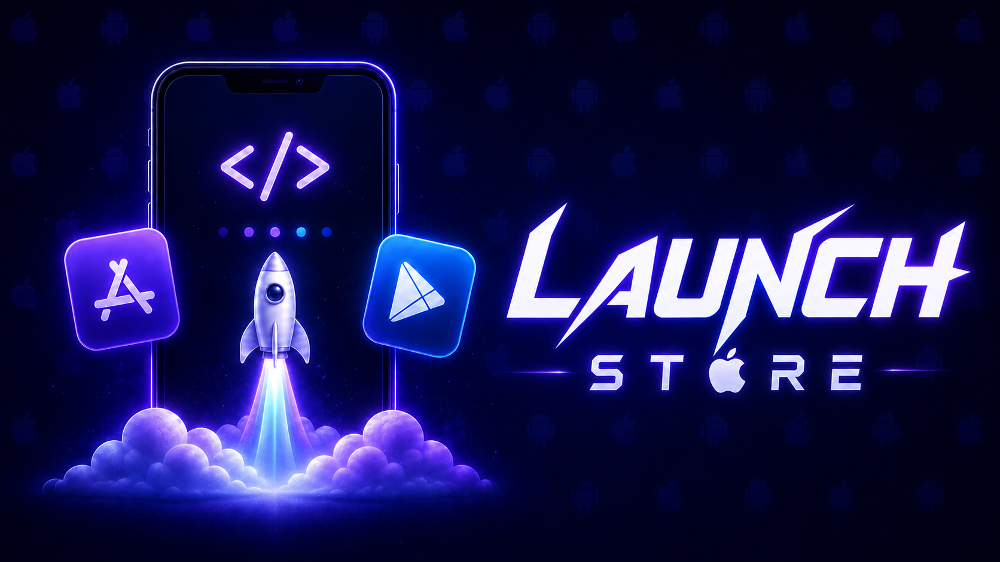

<p align="center">
  <a href="https://github.com/YosefHayim/launch-store"></a>
</p>

<p align="center">
  <strong>开源、可自托管的 Expo EAS 替代方案——用一个带类型的 launch.config.ts，在你自己的机器上、用你自己的密钥，构建、签名、配置商店，并将你的 Expo / React Native 应用发布到 App Store 与 Google Play。没有按次构建的账单。</strong>
</p>

<p align="center">
  <a href="https://www.npmjs.com/package/launch-store"></a>
  <a href="https://www.npmjs.com/package/launch-store"></a>
  <a href="https://github.com/YosefHayim/launch-store/actions/workflows/ci.yml"></a>
  <a href="./LICENSE"></a>
  
  
</p>

<!-- stats-badges:start — generated by `npm run docs:gen`; edit the source, then regenerate. -->

<p align="center">
  <a href="./docs/commands.md"></a>
  
  <a href="https://github.com/YosefHayim/launch-store/actions/workflows/ci.yml"></a>
</p>

<!-- stats-badges:end -->

<p align="center">
  <a href="./README.md">English</a> ·
  <b>简体中文</b> ·
  <a href="./README.ja.md">日本語</a> ·
  <a href="./README.ko.md">한국어</a> ·
  <a href="./README.es.md">Español</a> ·
  <a href="./README.pt-BR.md">Português</a> ·
  <a href="./README.fr.md">Français</a> ·
  <a href="./README.de.md">Deutsch</a> ·
  <a href="./README.ru.md">Русский</a>
</p>

<p align="center">
  📦 <a href="https://github.com/YosefHayim/launch-store/releases">发布与更新日志</a>
</p>

发布一个应用远不止是一次构建：签名配置、[App Store Connect](https://developer.apple.com/app-store-connect/) / [Play Console](https://play.google.com/console) 配置、应用内购买、商店列表元数据、上传，以及之后的空中下发（OTA）更新。EAS 负责构建和提交——其余的部分则散落在 Apple 和 Google 的各个门户以及一堆工具之间。Launch 把**整个发布流程**收拢进一套本地的、声明式的工作流：它为你配置签名、协调你的商店产品、生成原生工程、构建并签名二进制文件、报告真实的每设备下载体积、保存构建产物，并上传到测试通道——全部运行在你自己拥有的硬件上，密钥始终留在你本地的钥匙串里。iOS 签名需要一台 Mac；如果你没有，Launch 可以在**你自己的** AWS 账户里用一台云端 Mac 构建，或者交给 Expo EAS——参见[无 Mac 构建](#无-mac-构建)。

> **第一次使用？** 运行 `launch demo`，用 60 秒看一遍整条流水线的模拟演示——无需任何配置、无需构建、无需账户。第一次运行 `launch` 时它也会自动播放。

<!-- Feature map — one badge per stage of the release, in pipeline order. Mirrors the Features section below. -->
<table align="center">
  <tr>
    <td align="center"></td>
    <td align="center"></td>
    <td align="center"></td>
    <td align="center"></td>
    <td align="center"></td>
  </tr>
  <tr>
    <td align="center"></td>
    <td align="center"></td>
    <td align="center"></td>
    <td align="center"></td>
    <td align="center"></td>
  </tr>
</table>

## 为什么选择 Launch

构建从来都不是难点——围绕构建的整个发布过程才是。Launch 完全接管这整片领域，本地运行，开源：

- **整个发布流程，一套工作流。** 签名、商店产品、构建、体积检查、上传，以及 OTA 更新都源自同一份 `launch.config.ts` 和少数几条命令——而不是十几个控制台和 CI 片段。
- **商店配置即代码。** `launch sync` 依据同一份带类型的 `launch.config.ts`，把应用内购买、订阅、定价和能力（capabilities）协调到 App Store Connect 上；另有十几条命令覆盖 Game Center、Wallet、App Clips、应用内活动、A/B 实验、地区，以及整个 Google Play 目录——再加上用于商店列表的 `launch metadata`。这些正是 EAS 留给你手动点击的部分。
- **零计算费用，无限次构建。** EAS 按构建次数计费，免费额度被 45 分钟超时卡住，付费方案为 **$19–$199/月**外加超额费用。Launch 在你自己的机器上构建——没有计费器、没有排队、没有超时。
- **你的密钥始终在本地。** 你的分发证书、App Store Connect API 密钥和 Android 上传密钥都留在你的操作系统钥匙串里；Launch 只会向 Apple 发送一份 CSR。（无 Mac 构建是唯一的例外——见下文。）
- **永不锁定。** 采用 MIT 许可，构建于 `fastlane`、Gradle 以及各平台自己的 API 之上，存储/凭据/构建/提交提供方均可插拔。没有任何专有内容会在日后逼你迁移。
- **边运行边讲解。** 给任意命令加上 `--explain`——或者运行 `launch demo`——就能把每个步骤（CSR、配置描述文件、TestFlight、Play 通道、订阅组）展开成通俗易懂的说明。

## Launch 是什么——又不是什么

**Launch 是**一款端到端的发布工具：它接管从源码到商店的整条路径——构建、代码签名、体积检查、商店配置即代码、上传、公开发布，以及 OTA 更新——同时面向 iOS 和 Android，运行在你自己拥有的硬件上。

**Launch 不是**仅仅一个 App Store Connect SDK 或一个 ASC MCP 服务器。那些工具只是封装了 Apple API 的一小部分；而 Launch 驱动横跨 Apple **与** Google 的整个发布流程，包含 API 封装层根本触及不到的签名、构建与 OTA 更新。如果你想要一个可自托管的 Expo EAS——而不只是一个 API 客户端——那就是 Launch。

## 功能特性

**配置与校验**

- **一步完成配置。** `launch init` 检测你的应用——包括 `apps/*` 形式的 monorepo——并写出一份带注释的 `launch.config.ts`（外加一份初始的 `.env.example`）。它只写配置；绝不触碰凭据或原生工程。
- **密钥进钥匙串。** `launch creds set-key` 会在 `~/Downloads` 里找到 `AuthKey_*.p8`，对 Apple 进行校验，并存入你操作系统的密钥存储；`creds setup` 注册应用 id 并创建或复用签名资产；多账户的 `creds use/rename/remove` 在团队之间切换。`creds push-key` 把一份只能下载一次的 APNs 鉴权密钥（Apple 没有提供创建它的 API）封存起来，并按需重新导出。
- **用密钥保险库，而非明文 `.env`。** `launch secret set <NAME>` 把构建密钥存入你的操作系统钥匙串（按应用/配置档案隔离），并将其注入到构建环境中——从而让真正的机密远离已提交的 `.env`；`secret list`（带掩码）与 `secret rm` 使其功能完整。
- **`launch doctor --fix`。** 检测 iOS/Android 工具链并在单次授权下安装缺失的、可通过 brew 安装的工具（`--yes` 可为 CI/智能体跳过该授权），标记出商店侧的阻塞项——缺失的 App Store Connect 记录、未签署的 Apple 协议——并校验你的 Expo 配置中已知的原生配置陷阱（错误的 bundle id / 包名、缺少 `backgroundColor` 的启动屏）——这正是 `launch build` 在开始前运行的同一套预检，因此一行配置错误会在一秒内失败，而不是耗到一次构建之后。它还会暴露 EAS 默不作声的两个提交时坑点：**导出合规**问题的答案（从 `ios.config.usesNonExemptEncryption` 读取一次，配合 `--fix` 则通过 API 在最新构建上作答），以及一次性的手动 **App 隐私**问卷——Apple 没有为它提供任何 API，因此 Launch 会直接打印精确的核对清单，而不是任由它在提交时出其不意地造成阻塞。
- **签名状态一目了然。** `launch setup ios` 端到端报告你的 iOS 配置状况——当前账户、App ID、能力、分发证书、描述文件，以及已注册的设备——并且加上 `--provision` 时会确保证书 + App Store 描述文件就绪，与 `launch creds setup` 相同。

**配置 App Store Connect——即代码**

下面每个分项都在 `launch.config.ts`（或其独立的 `*.config.json` 伴随文件）中声明，并通过只读的**计划 → 你的确认 → 应用**进行协调——幂等执行，绝不触碰已上线或审核中的版本。这一整片正是 EAS 完全留给 App Store Connect 网站去做的部分。

- **产品、定价与商店列表。** `launch sync` 把你的应用内购买、订阅、能力和**定价**协调到 App Store Connect 上——并且在同一趟里，处理各语言区域的**商店列表文案**（名称、副标题、描述、关键词、更新说明，以及隐私 / 支持 / 营销 URL）、**截图**和**应用预览**——一次覆盖所有应用。
- **订阅优惠。** `launch offers` 协调优惠码以及促销、引导和挽回（win-back）优惠，外加被推广购买项的排序；`launch offers generate-codes/list/deactivate` 从 CLI 驱动优惠码活动。
- **发布属性。** `launch release-config` 把 App Store 的**年龄分级、类别、基础价格，以及 App 审核详情**（联系人 + 演示账户）协调到可编辑的版本上。
- **应用标识与授权（entitlements）。** `launch game-center`（成就与排行榜）、`launch wallet`（Apple Pay 商户 id 与 Wallet 卡券类型 id）、`launch app-clips`（App Clip 卡片操作 + 副标题），以及 `launch eu-distribution`（针对 DMA 的欧盟替代分发域名 + 包签名密钥）——这些是 `spaceship` 暴露、但 EAS 不涉及的、需要在门户里点击完成的团队设置。
- **营销陈列与展示。** `launch availability`（应用在哪些地区销售）、`launch custom-pages`（备用产品页面）、`launch experiments`（产品页 A/B 测试）、`launch accessibility`（无障碍营养标签）、`launch events`（应用内活动），以及 `launch metadata pull/push`（**iOS _和_ Android** 的完整商店列表——`eas metadata` 仅支持 iOS）。

**配置 Google Play——即代码**

- **Play 产品与订阅。** `launch play-products` 和 `launch play-subscriptions` 依据驱动 App Store Connect 的**同一份** `launch.config.ts` 目录，协调你的 Play 应用内产品和订阅（基础方案 + 优惠）——单一事实来源，两个商店通用。
- **通道与评论。** `launch play-tracks` 显示通道状态，并以你选定的发布比例和发布说明把某个构建**晋级**到某条通道（同时读取/设置测试者群组）；`launch play-reviews` 读取 Play 客户评论并发布回复——无需打开 Play Console。

**构建与发布——iOS 与 Android**

- **每个平台一条命令。** `launch build ios` / `launch build android` 运行 prebuild → 签名 → 体积检查 → 上传到测试通道（TestFlight / Play 内部）——与 EAS 运行的流程相同。
- **默认就很快。** ccache 在 `pod install` 时接入，DerivedData 保持热态，而原生依赖图指纹只在你的原生依赖确实发生变化时才强制全新构建。JS 改动会增量重建；`--clean` 强制从头开始。
- **真实的下载体积检查。** 报告实际的每设备体积（App Thinning 报告 / bundletool），并依据你配置的 `sizeBudgetMB` 进行门禁拦截。
- **安全防护网。** 拒绝上传模拟器构建、`.app` 或空的构建产物；`--dry-run` 在不触及网络、构建或账户的情况下预演整条流水线。
- **审慎的公开发布——无需门户。** 测试通道是默认目标；公开商店则是单独的、需确认的 `launch release <platform>`。对于 iOS，它端到端驱动 App Store Connect API——创建/复用版本、回答导出合规、附加构建、撰写发布说明、选择立即 / 定时 / 分阶段发布，并提交审核——所以发布永远无需网站。`launch status [--watch] [--json]` 跟踪审核（带 CI 退出码），而 `launch rollout pause|resume|complete` 操控分阶段发布。fastlane 的职责仅限于二进制文件的上传。
- **无需重新构建即可重新签名。** `launch build:resign` 直接从构建产物出发，用不同的凭据（新账户或新描述文件）重新签名已保存的 `.ipa`/`.aab`——无需重建。
- **完成通知。** 一个 `notify` 配置块会在构建或提交完成时——无论**成功还是**失败——ping 一个 Slack/Discord webhook 和/或运行一个 shell 钩子——这样无人值守/CI 的运行就能在完成时告知你。与 EAS 的 `webhook` 对等，且无需托管服务。

**分发与更新**

- **内部分发。** `launch build <platform> --distribution internal` 在你自己的存储桶上托管一个临时的 iOS 安装链接 / Android `.apk`；用 `launch device add <udid>` 注册测试者。
- **空中下发（OTA）更新。** `launch update` 通过 `expo-updates` 早已使用的 **Expo Updates 协议**发布一次 JS/资源更新——经过代码签名，并托管在你自己的存储桶上（S3 / R2 / Supabase）。
- **回滚一次糟糕的更新。** `launch updates list/view` 显示各通道的历史记录；`launch updates rollback` 撤销一次糟糕的 OTA——晋级一个已知良好的更新，或把测试者退回到内嵌的 bundle。

**管理测试者、团队、评论与报告——仅用 API 密钥**

- **从 CLI 操作 TestFlight。** `launch testflight groups/create-group/testers/add/rm` 通过同一把 App Store Connect API 密钥管理 Beta 群组并邀请测试者——这是围绕构建上传的管理层，无需 Apple ID 密码，无需 2FA。
- **评论，读取与回复。** `launch reviews [list]` 读取客户评论（按评分 / 地区过滤）；`launch reviews reply` 发布或替换开发者回复，`launch reviews delete` 删除它——无需打开 App Store Connect。
- **销售、财务与分析报告。** `launch reports sales/finance/analytics` 把 App Store Connect 的销售与趋势、财务、分析报告（gzip 压缩的 TSV）直接下载到你的机器上以供脚本处理——这些是 EAS 从不呈现的数字。
- **团队与访问权限。** `launch team list/invite/remove` 读取并管理 App Store Connect 的团队成员和待处理邀请——按邮箱带角色邀请，或撤销——通过同一把 API 密钥完成。
- **沙盒测试者。** `launch sandbox list/clear` 列出你的 StoreKit 沙盒测试者并清除他们的购买历史，让你能从一个干净的起点重新测试应用内购买。

**检查与调试**

- **构建历史。** `launch builds list/view/log` 读取本地构建产物索引——id、每设备体积、产物路径，以及任意构建的原始构建日志。
- **安装并运行。** `launch run [id|latest]` 把一个已构建的产物安装到连接的设备或模拟器上（Android 用 `adb`/`bundletool`，iOS 用 `devicectl`）。
- **解释一次失败。** `launch diagnose` 把 `xcodebuild`/Gradle/CocoaPods 的错误映射为通俗的原因与修复方案；`launch fingerprint` 说明为什么下一次构建会是全新的还是增量的。`--verbose` 会流式输出原始构建日志，而非进度旋转图标。

**入门与讲解**

- **`launch demo`。** 对整条流水线的零配置模拟演练（首次运行时自动播放一次）；任意命令上的 `--explain` 和 `launch explain <topic>` 按需讲解相关术语。
- **静默自升级。** 检测到更新的 npm 发布版本后会在其上重新运行你的命令——限速为每天一次，且在 CI 中、管道中以及对智能体而言均为空操作。

## Launch vs EAS

Launch 在你自己拥有的硬件上运行与 `eas build` → `eas submit` → `eas update` 相同的流水线（外加 `eas metadata` 和 `eas credentials`）——并且覆盖了 EAS 留给你自己处理的商店配置步骤。在两者针对同一工作流的差异之处：

| 在 Expo EAS 中                                                                               | 在 Launch 中                                                                                                                             |
| -------------------------------------------------------------------------------------------- | ---------------------------------------------------------------------------------------------------------------------------------------- |
| 构建计算运行在 **Expo 的云端**，**$19–$199/月** + 按构建收费                                 | 在**你自己的机器**上构建——**零计算费用**，MIT 许可，无限次构建                                                                           |
| 构建在共享云端**排队**，有时一排就是几个小时                                                 | 构建在你的硬件上**立即开始**——无需排队                                                                                                   |
| 免费额度的构建被**限制在 45 分钟超时**之内                                                   | **无超时**——构建需要多久就跑多久                                                                                                         |
| Apple ID 的 **2FA** 提示 / 过期验证码会打断构建                                              | 使用 **App Store Connect API 密钥（JWT）**鉴权——无密码，无 2FA                                                                           |
| 工具链/Node **由构建镜像锁定**；本地 `.env` 不会被解析                                       | 你自己的 Xcode/Node/工具链，以及一套有文档的**环境优先级阶梯**（用 `--print-env` 审计）                                                  |
| **应用内购买与订阅**在 ASC 界面里全靠手动                                                    | `launch sync` 依据 `launch.config.ts` 协调 **IAP、订阅与能力**                                                                           |
| EAS **每次构建都重写 bundle-id 能力**（会覆盖掉各种开关）                                    | `launch sync` 应用**最小安全差异（safe-diff）**——它不管理的能力保持原样                                                                  |
| `eas metadata` **仅支持 iOS**                                                                | `launch metadata` 为 **iOS _和_ Android** 同步商店列表                                                                                   |
| Play 的 **IAP、订阅、通道与评论**意味着要用 Play Console 界面                                | `launch play-products` / `play-subscriptions` 依据**同一份**配置协调 Play；`launch play-tracks` / `play-reviews` 通过 API 驱动通道与回复 |
| **Game Center、Wallet、App Clips、应用内活动、A/B 实验、地区与无障碍**都**只能在门户里操作** | 每一项都是**配置即代码**——`launch game-center` / `wallet` / `app-clips` / `events` / `experiments` / `availability` / `accessibility`    |
| `eas submit` 之后，**App Store 发布**（版本、合规、说明、发布比例）仍是**门户里的手动活**    | `launch release` 通过 **API** 驱动它——然后 `launch status --watch` 和 `launch rollout` 跟踪并操控它                                      |
| **评论、报告与 TestFlight 管理**意味着要跑一趟网站                                           | `launch reviews` / `launch reports` / `launch testflight` 都通过 **API 密钥**完成——无需门户                                              |
| **EAS Update** 把你的 OTA 更新托管在 **Expo 的服务器**上（付费）                             | `launch update` 从**你自己的存储桶**（S3/R2/Supabase）提供**相同的 Expo Updates 协议**                                                   |
| **内部分发**构建由 Expo 托管                                                                 | `--distribution internal` 把临时的 `.ipa`/`.apk` 托管在**你自己的存储桶**上；`launch device`                                             |
| 签名**凭据可能存放在 Expo 的服务器**上                                                       | 密钥留在**你的操作系统钥匙串**里——只有一份 **CSR** 会离开你的机器                                                                        |
| 构建**产物托管在 Expo**                                                                      | 产物落在**你自己的存储**里（本地，或 S3 / R2 / Supabase）                                                                                |
| **没有 Mac？** EAS 的付费云端是唯一途径                                                      | **没有 Mac？** 一台在**你自己 AWS** 里的云端 Mac、任意一台通过 **SSH** 连接的 Mac，或交给 **`eas build`**                                |
| **闭源 SaaS**——专有，供应商锁定                                                              | **MIT，开源**——`fastlane`/Gradle/平台 API，提供方可替换，无任何需要迁移的东西                                                            |

## 环境要求

- **iOS：** 一个 **Apple Developer Program** 会员资格（99 美元/年）——[在此注册](https://developer.apple.com/programs/enroll/)——然后是装有 **Xcode** + 命令行工具、**fastlane**（`brew install fastlane`）的 macOS，以及一把 **App Store Connect API 密钥**（`.p8` + Key ID + Issuer ID）——[在此生成一把](https://appstoreconnect.apple.com/access/integrations/api)。没有 Mac？参见[无 Mac 构建](#无-mac-构建)。
- **Android：** 一个 **Google Play 开发者账户**（一次性 25 美元）——[在此注册](https://play.google.com/console/signup)——然后是一个 **JDK**（任意操作系统——无需 Mac）和一把 **Google Play 服务账户** JSON 密钥。
- 每个平台上都需要 **Node 20+**。

随时运行 `launch doctor` 即可检查上述所有项。

## 安装

```bash
npm install --save-dev launch-store     # per-project (recommended; resolves the typed launch.config.ts)
npm install --global launch-store       # or global, for just the `launch` command
```

## 快速开始

从付费墙到测试通道，五条命令搞定（把 `ios` → `android` 互换即可发布到 Google Play）：

```bash
launch init                 # scaffold launch.config.ts + .env.example, tailored to your repo
launch creds set-key        # import your store API key into the OS keychain
launch creds setup          # register the app id + create/reuse signing assets
launch build ios --dry-run  # rehearse the whole flow — no network, no build, no account changes
launch build ios            # build, sign, size-check, and upload to the testing track
```

`launch build` 会静默复用你已缓存的凭据；如果缺失，它会就地提议为你完成配置。公开发布则是单独的、需审慎执行的 `launch release <platform>`。

要销售应用内购买或订阅？在 `launch.config.ts` 里声明它们，再运行 `launch sync` 在 App Store Connect 上创建并协调它们——无需在门户里逐项点击。

已经在发布某个应用了？`launch adopt` 读取你线上的 App Store Connect 设置——产品、能力、签名和商店列表——并一步把它们写回配置，这样你就能用 `sync` 继续向前驱动它。

## 命令

日常常用的那些：

| 命令                            | 它做什么                                                                 |
| ------------------------------- | ------------------------------------------------------------------------ |
| `launch build <ios\|android>`   | 运行完整流水线——prebuild、签名、构建、体积检查、上传到测试通道。         |
| `launch release <ios\|android>` | 把最新构建发布到**公开**商店，需确认。                                   |
| `launch update`                 | 向你自己的存储桶发布一次空中下发（OTA）的 JS 更新（Expo Updates 协议）。 |
| `launch sync`                   | 依据 `launch.config.ts` 协调 App Store Connect 的产品、定价和商店列表。  |
| `launch adopt`                  | 接管一个已经在发布的应用——把它的 App Store Connect 设置导入配置。        |
| `launch creds`                  | 检查凭据、导入 API 密钥、配置签名、切换 Apple 账户。                     |
| `launch doctor`                 | 检查本地工具链和商店账户是否就绪。                                       |

**[完整命令参考 → `docs/commands.md`](docs/commands.md)**——全部 45 条命令及每个标志，从 CLI 生成，因此永不脱节。或者运行 `launch <command> --help`。

<!-- agent-skills:start — generated by `npm run docs:gen` from AGENT_SKILLS_BLURB; edit the source, then regenerate. -->

> **Driving Launch from an AI agent?** `launch agents init` scaffolds ready-made skills into your repo — Claude Skills (`.claude/skills/`), Cursor rules (`.cursor/rules/`), and a Launch section in `AGENTS.md` for Codex — so Claude Code, Cursor, and Codex can run the workflows above (ship, release, store-config-as-code, OTA updates, CI, and `launch doctor`) with the same plan → confirm → apply guardrails Launch uses, and never publish without your say-so. `launch agents check` keeps them in sync.

<!-- agent-skills:end -->

## 配置

应用本身的信息（bundle id、版本）从每个应用的 Expo 配置中读取——`app.json` 或 `app.config.{ts,js}`——因此它们绝不会被重复声明。`launch.config.ts` 只保存 Launch 专有的设置：

```ts
import { defineConfig } from "launch-store";

export default defineConfig({
  // appRoots: ["./apps"],   // for a monorepo; omit to scan the repo root
  credentials: "local", // OS keychain + ~/.launch
  storage: "local", // ~/.launch/artifacts (swap for s3/r2/supabase later)
  buildEngine: "fastlane", // "fastlane" (local Mac) · "remote-mac" (AWS EC2 Mac) · "eas" (Expo cloud)
  // submit: "app-store-connect", // or "eas" to submit through Expo

  // Only needed to build iOS without a Mac via `--remote aws` — see "Building without a Mac".
  // aws: { region: "us-east-1" },

  profiles: {
    // `env` is inline per-profile vars; `envFile` renames the base dotenv. Precedence, highest first:
    // --env flags › keychain secrets › profile `env:` › .env.local (--include-local) › .env.<profile> › .env
    production: { name: "production", envFile: ".env", env: {}, sizeBudgetMB: 200 },
  },

  // Ping a Slack/Discord webhook and/or run a shell hook when a build or submit finishes (success or
  // failure). Both fields are optional; omit `notify` entirely for no notifications.
  // notify: { webhookUrl: "https://hooks.slack.com/services/…", command: "say build done" },

  // In-app purchases & subscriptions, keyed by bundle id — `launch sync` reconciles these onto App Store
  // Connect (and `launch play-products` / `play-subscriptions` onto Google Play). Capabilities aren't
  // declared here; they're read from app.json's `ios.entitlements`. Omit if your app sells nothing.
  // products: { "com.company.app": { subscriptionGroups: [/* … */], inAppPurchases: [/* … */] } },

  // Launch-native App Store Connect sections — each reconciled by its own command, declared inline here
  // (or, for back-compat, as a standalone `*.config.json` sidecar). Per-app ones are keyed by iOS bundle
  // id; Wallet & EU distribution are team-level. See examples/hello-world for a worked copy of each.
  // gameCenter: { "com.company.app": { achievements: [/* … */], leaderboards: [/* … */] } },
  // appClips: { "com.company.app": { clips: { "com.company.app.Clip": { action: "OPEN" } } } },
  // releaseAttributes: { "com.company.app": { pricing: { customerPrice: 9.99 }, categories: { primary: "PRODUCTIVITY" } } },
  // wallet: { merchantIds: [/* … */], passTypeIds: [/* … */] },
  // euDistribution: { domains: [/* … */] },
});
```

运行 `launch build <platform> --print-env`，即可在任何一次构建运行之前，看到完全解析后的环境以及每个值的来源（机密会被掩码）。一份覆盖全部功能、双平台（iOS + Android）的示例——演练了从产品、优惠、发布属性到 Game Center、Wallet、欧盟分发和 Google Play 目录在内的每一个配置即代码的层面——位于 [`examples/hello-world`](./examples/hello-world)（其 README 里有逐项功能的导览）。

## 无 Mac 构建

iOS 签名仅限 macOS，所以一名 Windows/Linux 开发者总归需要在某处有一台 Mac。运行 `launch`（向导），或者直接挑一条路径。Android 在任何能跑 JDK 的地方都能构建，因此这一切都与它无关。

| 路径                    | 会发生什么                                                                               | 成本                                                                                     |
| ----------------------- | ---------------------------------------------------------------------------------------- | ---------------------------------------------------------------------------------------- |
| **AWS 云端 Mac**        | Launch 在**你自己的** AWS 账户里配置一台 EC2 Mac，完成构建 + 签名 + 提交，然后将其拆除。 | 你直接付费给 AWS——**每 24 小时会话最低约 $16**（Apple 的许可设定了 24 小时的硬性下限）。 |
| **连接一台 Mac（SSH）** | 在你能连上的任意一台 Mac 上构建——同事的、MacStadium 的，或一台手动启动的实例。           | 那台 Mac 给你带来的任何费用。                                                            |
| **Expo EAS**            | Launch 在 Expo 的云端端到端编排 `eas-cli`（`eas build` → 下载 → `eas submit`）。         | Expo 的**免费额度**，带月度上限。                                                        |

```bash
launch build ios --remote aws            # build on a cloud Mac in your AWS account
launch build ios --remote ec2-user@host  # build on a Mac you reach over SSH
launch cloud doctor                      # check AWS creds, region, Mac-host quota, IAM
launch cloud status                      # live host: age, cost so far, releasable-after time
launch cloud teardown                    # stop + release the host (warns about the 24h floor)
```

远程构建会在明确授权下把你签名密钥的一份临时副本上传到**你自己的**主机，并在事后将其粉碎——绝不会发往任何他人的服务器。对于偶尔的 iOS 构建，一台 GitHub Actions 的 macOS 运行器比 EC2 Mac 更便宜；Launch 在此处的价值在于：在你自己的账户里实现自动化，且各处用的都是同一套密钥。

## 你的凭据是如何处理的

- API 密钥（`.p8`）、分发私钥和 Android 上传密钥都存在你的**操作系统钥匙串**里。
- iOS 证书还会以一个受密码保护的 `.p12` 形式备份在 `~/.launch/credentials/` 下（chmod 600）；该密码存放在钥匙串中，绝不会放在文件旁边。
- 你的私钥在本地生成——只有一份 CSR 会被发送给 Apple。
- Launch 会复用已有的分发证书，而不是创建新证书（商店对它们有数量上限）。

## 常见问题

**Launch 是什么？** Launch 是一款开源的、可自托管的 Expo EAS 替代方案：它在你自己的机器上、用你自己的密钥，将 Expo / React Native 应用构建、签名并发布到 TestFlight 和 Google Play，无任何按次构建的账单。它运行与 EAS 相同的 构建 → 提交 → 更新 流水线，并在此之上增加了 EAS 留给 App Store Connect 和 Play Console 网站的商店配置步骤——应用内购买、订阅、能力（capabilities）以及商店列表元数据——以代码的方式来管理。

**Launch 是免费的开源 Expo EAS 替代方案吗？** 是的。Launch 采用 MIT 许可且完全开源，构建运行在你自己拥有的硬件上，因此没有按次构建的费用、按分钟计费的表，也没有月度订阅——相较于 EAS 的 $19–$199/mo 付费档位加上按构建的超额收费。唯一的可选费用是：在没有 Mac 的情况下构建 iOS 时，租用一台云端 Mac。

**Launch 与 Expo EAS 有何不同？** EAS 在 Expo 的云端运行你的构建，并将你的凭据、产物和 OTA 更新保存在 Expo 的服务器上。Launch 在你自己的机器上运行相同的流水线，将签名密钥保存在你的操作系统钥匙串中，并将产物和 OTA 更新存放在你自己的存储桶（S3 / R2 / Supabase）里——同时将 EAS 不涉及的商店配置（IAP、订阅、能力，以及 iOS 和 Android 商店列表）以代码的方式进行管理。命令一一对应：`eas build` → `launch build`，`eas submit` → `launch release`，`eas update` → `launch update`，`eas metadata` → `launch metadata`，`eas credentials` → `launch creds`。

**我可以在没有 Mac 的情况下构建 iOS 应用吗？** iOS 代码签名和构建工具链仅限 macOS，因此流程中必须有一台 Mac——但不一定非得是你自己的。Launch 可以在你自己的 AWS 账户中配置一台云端 Mac（EC2 Mac），通过 SSH 在你能连接的任意 Mac 上构建，或者将任务移交给 Expo EAS 的云端。Android 在任何能运行 JDK 的地方都能构建，完全无需 Mac。

**Launch 支持 Android 和 Google Play 吗？** 支持。Launch 构建并签名 Android 应用，并将其上传到 Google Play；同时，它依据驱动 App Store Connect 的同一份 `launch.config.ts` 目录，协调 Play 应用内产品、订阅（基础方案 + 优惠）、发布通道和评论回复——两个商店共用单一事实来源。

**Launch 像 EAS Update 一样支持空中下发（OTA）更新吗？** 支持。`launch update` 通过你的 `expo-updates` 运行时早已使用的 Expo Updates 协议发布 JS 和资源更新——经过代码签名，并托管在你自己的存储桶（S3 / R2 / Supabase）上，而非 Expo 的服务器。`launch updates rollback` 通过晋级一个已知良好的更新，或让客户端回退到内嵌 bundle，来撤销一次糟糕的发布。

**如何从 Expo EAS 迁移到 Launch？** 一一替换命令即可（`eas build` → `launch build`，`eas submit` → `launch release`，`eas update` → `launch update`，`eas credentials` → `launch creds`，`eas metadata` → `launch metadata`）。如果你的应用已在发布，`launch adopt` 会读取其线上的 App Store Connect 设置——产品、能力、签名和商店列表——并一步将它们写回 `launch.config.ts`。Launch 也仍然可以在你没有 Mac 时将任务移交给 `eas build`，因此你可以渐进式地迁移。

**Launch 只是一个 App Store Connect SDK 或 MCP 封装器吗？** 不是。App Store Connect SDK 或 MCP 服务器只封装了 Apple API 的一小部分。Launch 驱动横跨 Apple 和 Google 的整个发布流程——代码签名、原生构建、体积检查、商店配置即代码、经确认的公开发布，以及 OTA 更新——这些都是 API 封装层根本触及不到的。如果你想要一个可自托管的 Expo EAS 而非一个 API 客户端，那就是 Launch。

**Launch 与 Fastlane 有何不同？** Fastlane 是一块积木；Launch 则是编排者。Launch 仅将 fastlane 用于二进制文件上传步骤，并在其周围包裹了完整的发布流程：凭据配置、构建、真实的下载体积检查、两个商店的商店配置即代码、审慎的公开发布、分阶段发布控制，以及 OTA 更新——所有这一切都来自同一份有类型的 `launch.config.ts`。

**我的签名密钥和机密存放在哪里？** 在你的操作系统钥匙串里。你的 App Store Connect API 密钥（`.p8`）、分发私钥和 Android 上传密钥绝不会触碰仓库或任何人的服务器——只有一份证书签名请求（CSR）会被发送给 Apple。构建机密同样通过 `launch secret` 存放在钥匙串中，从而让它们远离已提交的 `.env`。

**运行 Launch 需要什么？** 处处都需要 Node 20+。对于 iOS：需要装有 Xcode 和命令行工具、fastlane，以及 App Store Connect API 密钥（`.p8` + Key ID + Issuer ID）的 macOS——或者在没有本地 Mac 时使用远程 Mac。对于 Android：需要一个 JDK（任意操作系统）和一把 Google Play 服务账户 JSON 密钥。运行 `launch doctor` 可一次检查所有项。

**Launch 的费用是多少？** Launch 本身是免费的（MIT）。你只需为本来就要付费的东西买单：你自己的构建硬件（或者在没有本地 Mac 的情况下构建 iOS 时的云端 Mac 时间），加上常规的 Apple Developer 费用（$99/yr）和 Google Play 注册费（一次性 $25）。没有按次构建的收费，也没有订阅。

**Launch 能在 CI 中运行吗？** 能。`launch ci init` 在一台托管的 macOS 运行器上脚手架生成一份 GitHub Actions 工作流，并且每条命令在检测到 CI、管道输出或智能体时都会自动降级为非交互模式——因此相同的流程可以无人值守地运行。

**Launch 支持哪些框架？** 通过 Expo 配置（`app.json` / `app.config.{ts,js}`）和 `expo prebuild` 来自我描述的 Expo 和裸 React Native 应用。Launch 从中读取你的 bundle id、版本和授权（entitlements），因此无需重复声明。

**Launch 能管理商店元数据、应用内购买和订阅吗？** 能——以代码方式，面向两个商店。`launch sync` 将 IAP、订阅、定价、能力，以及各语言区域的商店列表（文案、截图、预览）协调到 App Store Connect 上；`launch metadata` 覆盖 iOS 和 Android 的商店列表；`launch play-products` / `launch play-subscriptions` 驱动 Google Play 目录。每项操作均执行只读的 计划 → 确认 → 应用 流程，因此绝不会覆盖线上版本或审核中的版本。

**Launch 会把我锁定在某个托管服务上吗？** 不会——没有任何托管内容，也没有任何专有内容。Launch 采用 MIT 许可，构建于 fastlane、Gradle 和各平台自己的 API 之上，存储/凭据/构建/提交提供方均可插拔。你的密钥、产物和更新都存放在你掌控的基础设施里，因此日后无需迁移任何东西。

**如何开始使用？** 使用 `npm install --global launch-store`（或按项目 `--save-dev`）安装，然后运行 `launch demo`，进行一次 60 秒的模拟演练——无需任何配置或账户。准备好后：`launch init` → `launch creds set-key` → `launch creds setup` → `launch build ios`。

## 贡献

参见 [`CONTRIBUTING.md`](./CONTRIBUTING.md)，了解开发环境配置、质量门禁，以及如何添加一个后端。

## 贡献者

<p align="center">
  <a href="https://github.com/YosefHayim"></a>
</p>

<p align="center">
  <a href="https://github.com/YosefHayim/launch-store/graphs/contributors">全部贡献者 →</a>
</p>

## 许可证

MIT

---

<sub>Launch 是一个开源的 **Expo EAS 替代方案**——一种本地、可自托管的方式，让你**在自己的机器上构建并将 React Native 应用发布到 App Store 和 Google Play**：iOS 代码签名、TestFlight 与 Google Play 提交、商店配置即代码，以及基于 Expo 协议的 OTA 更新，且没有按次构建的账单。</sub>
